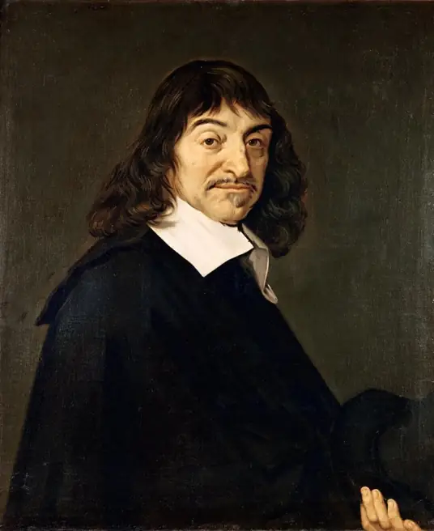

# 1596-1650 笛卡尔 Descartes

勒内·笛卡尔（René Descartes，1596年3月31日–1650年2月11日）

法国哲学家、数学家、物理学家。他对现代数学的发展作出了重要的贡献，由于他的几何坐标系的公式化而被认为是解析几何之父。

- 1637年他发表了用法文写的第一部著作《论方法》，产生了很大影响。
- 1641年他又用拉丁文发表了《形而上学的沉思》，比较详细地论证了他已经提出的论点，并且附有事前向当时著名哲学家们征求来的诘难，以及他自己对这些诘难的驳辩。
- 1644年，笛卡儿发表了他的系统著作《哲学原理》，这部书不仅包括他已经发表的思想，而且论述了他的物理学理论，还包括过去未发表的《世界》一书的一些内容。
- 1649年，他最后发表了心理学著作《论心灵的感情》。

笛卡尔最为世人熟知的是其作为数学家的成就。他于1637年发明了现代数学的基础工具之一——坐标系，将几何和代数相结合，创立了解析几何学。同时，他也推导出了笛卡尔定理等几何学公式。值得一提的是，传说著名的心形线方程也是由笛卡尔提出的。

在哲学上，笛卡尔是一个二元论者以及理性主义者。他是欧陆“理性主义”的先驱。关于笛卡尔的哲学思想，最著名的就是他那句“我思故我在”。他的《第一哲学沉思集》（又名《形而上学的沉思》）仍然是许多大学哲学系的必读书目之一。

在物理学方面，笛卡尔将其坐标几何学应用到光学研究上，在《屈光学》中第一次对折射定律作出了理论上的推证。在他的《哲学原理》第二章中以第一和第二自然定律的形式首次比较完整地表述了惯性定律，并首次明确地提出了动量守恒定律。这些都为后来牛顿等人的研究奠定了一定的基础。

## 哲学方面

笛卡尔被广泛认为是西方现代哲学的奠基人之一，他第一个创立了一套完整的哲学体系。哲学上，笛卡尔是一个二元论者以及理性主义者。笛卡尔认为，人类应该可以使用数学的方法——也就是理性——来进行哲学思考。他相信，理性比感官的感受更可靠。（他举出了一个例子：人们在做梦时，会以为自己身在一个真实的世界中，然而其实这只是一种幻觉而已，参见庄周梦蝶）。他从逻辑学、几何学和代数学中发现了4条规则：

- 第一条是：凡是一个人没有明确地认识到地东西，他绝不把它当成真地接受。也就是说，要小心避免轻率地判断和先入之见，除了清楚分明地呈现在他心里、使他根本无法怀疑地东西以外，不要多放一点别地东西到他地判断里。
- 第二条是：把他所审查的每一个难题按照可能和必要的程度分成若干部分，以便一一妥为解决。
- 第三条是：按次序进行的思考，从最简单、最容易认识的对象开始，一点一点逐步上升，直到认识最复杂的对象；就连那些本来没有先后关系的东西，也给它们设定一个次序。
- 最后一条是：在任何情况之下，都要尽量全面地考察，尽量普遍地复查，做到确信毫无遗漏。
  
笛卡尔将这种方法不仅运用在哲学思考上，还运用于几何学，并创立了解析几何。

由此，笛卡尔第一步认为怀疑就是出发点，感官知觉的知识是可以被怀疑的，人们并不能信任自己的感官。

笛卡尔的自然哲学观同亚里士多德的学说是完全对立的。他认为，所有物质的东西，都是为同一机械规律所支配的机器，甚至人体也是如此。同时他又认为，除了机械的世界外，还有一个精神世界存在，这种二元论的观点后来成了欧洲人的根本思想方法。

虽然笛卡尔证明了真实世界的存在，他认为宇宙中共有2个不同的实体，既思考（心灵）和外在世界（物质），两者本体都来自于上帝，而上帝是独立存在的。他认为，只有人才有灵魂，人是一种二元的存在物，既会思考，也会占空间。而动物只属于物质世界。

笛卡尔强调思想是不可怀疑的这个出发点，对此后的欧洲哲学产生了重要的影响。“我思故我在”所产生的争议在于所谓的上帝存在及动物一元论（黑猩猩、章鱼、鹦鹉、海豚、大象等等都证实有智力），而怀疑的主要思想，确实对研究方面很有贡献。

## 方法论

笛卡尔本想在一本题为《世界》的书中介绍他的科研成果，但是当该书在1633年快要完稿时，他获悉意大利教会的权威伽利略有罪，因为他拥护哥白尼的日心说。虽然笛卡尔在荷兰未受到天主教权威的迫害，但是他还是决定谨慎从事，收书稿进箧入匣，因为在书中他捍卫了哥白尼的学说。但是在1637年他发表了最有名的著作《正确思维和发现科学真理的方法论》，通常简称为《方法论》。

笛卡尔在《方法论》中指出，研究问题的方法分四个步骤：

1. 永远不接受任何我自己不清楚的真理，就是说要尽量避免鲁莽和偏见，只能是根据自己的判断非常清楚和确定，没有任何值得怀疑的地方的真理。就是说只要没有经过自己切身体会的问题，不管有什么权威的结论，都可以怀疑。这就是著名的“怀疑一切”理论。例如亚里士多德曾下结论说，女人比男人少两颗牙齿。但事实并非如此。
2. 可以将要研究的复杂问题，尽量分解为多个比较简单的小问题，一个一个地分开解决。
3. 将这些小问题从简单到复杂排列，先从容易解决的问题着手。
4. 将所有问题解决后，再综合起来检验，看是否完全，是否将问题彻底解决了。

在1960年代以前，西方科学研究的方法，从机械到人体解剖的研究，基本是按照笛卡尔的《谈谈方法》进行的，对西方近代科学的飞速发展，起了相当大的促进作用。但也有其一定的缺陷，如人体功能，只是各部位机械的综合，而对其互相之间的作用则研究不透。直到阿波罗1号登月工程的出现，科学家才发现，有的复杂问题无法分解，必须以复杂的方法来对待，因此导致系统工程的出现，方法论的方法才第一次被综合性的方法所取代。系统工程的出现对许多大规模的西方传统科学起了相当大的促进作用，如环境科学，气象学，生物学，人工智能等等。

## 物理学方面

笛卡尔靠着天才的直觉和严密的数学推理，在物理学方面做出了有益的贡献。

从1619年读了约翰尼斯·开普勒的光学著作后，笛卡尔就一直关注着透镜理论；并从理论和实践两方面参与了对光的本质、反射与折射率以及磨制透镜的研究。他把光的理论视为整个知识体系中最重要的部分。笛卡尔坚信光是“即时”传播的，他在著作《论人》和《哲学原理》中，完整的阐发了关于光的本性的概念。笛卡尔运用他的坐标几何学从事光学研究,并在《屈光学》中首次对光的折射定律提出了理论论证。与荷兰的斯涅耳共同分享发现光的折射定律的荣誉。他认为光是压力在以太中的传播，他从光的发射论的观点出发，用网球打在布面上的模型来计算光在两种媒质分界面上的反射、折射和全反射，从而首次在假定平行于界面的速度分量不变的条件下导出折射定律；不过他的假定条件是错误的，他的推证得出了光由光疏媒质进入光密媒质时速度增大的错误结论。他还对人眼进行光学分析，解释了视力失常的原因是晶状体变形，设计了矫正视力的透镜。

他还用光的折射定律解释彩虹现象，并且通过元素微粒的旋转速度来分析颜色。

在力学方面，笛卡尔则发展了伽利略运动相对性的理论。例如在《哲学原理》一书中，举出在航行中的海船上海员怀表的表轮这一类生动的例子，用以说明运动与静止需要选择参考系的道理。

笛卡尔在《哲学原理》第二章中以第一和第二自然定律的形式比较完整地第一次表述了惯性定律：只要物体开始运动，就将继续以同一速度并沿着同一直线方向运动，直到遇到某种外来原因造成的阻碍或偏离为止。这里他强调了伽利略没有明确表述的惯性运动的直线性。

在这一章中，他还第一次明确地提出了动量守恒定律：物质和运动的总量永远保持不变。为能量守恒定律奠定了基础。
笛卡尔发现了动量守恒原理的原始形式（笛卡尔所定义的动量是一绝对值，不是向量，因此他的动量守恒原理后来也被证明是错误的）。

笛卡尔对碰撞和离心力等问题曾作过初步研究，给后来克里斯蒂安·惠更斯的成功创造了条件。

## 天文学方面

笛卡尔把他的机械论观点应用到天体，发展了宇宙演化论，形成了他关于宇宙发生与构造的学说。他认为，从发展的观点来看而不只是从已有的形态来观察，对事物更易于理解。他创立了漩涡说。他认为太阳的周围有巨大的漩涡，恒星。

他认为天体的运动来源于惯性和某种宇宙物质旋涡对天体的压力，在各种大小不同的旋涡的中心必有某一天体，以这种假说来解释天体间的相互作用。笛卡尔的太阳起源的以太旋涡模型第一次依靠力学而不是神学，解释了天体、太阳、行星、卫星、彗星等的形成过程，比康德的星云说早一个世纪，是17世纪中最有权威的宇宙论。

笛卡尔的天体演化说、旋涡模型和近距作用观点，正如他的整个思想体系一样，一方面以丰富的物理思想和严密的科学方法为特色，起着反对经院哲学、启发科学思维、推动当时自然科学前进的作用，对许多自然科学家的思想产生深远的影响；而另一方面又经常停留在直观和定性阶段，不是从定量的实验事实出发，因而一些具体结论往往有很多缺陷，成为后来牛顿物理学的主要对立面，导致了广泛的争论。

他认为太阳的周围有巨大的漩涡，带动着行星不断运转。物质的质点处于统一的漩涡之中，在运动中分化出土、空气和火三种元素，土形成行星，火则形成太阳和恒星。

## 数学方面

笛卡尔对数学最重要的贡献是创立了解析几何。在笛卡尔时代，代数还是一个比较新的学科，几何学的思维还在数学家的头脑中占有统治地位。笛卡尔致力于代数和几何联系起来的研究，并成功地将当时完全分开的代数和几何学联系到了一起。于1637年，在创立了坐标系后，成功地创立了解析几何学。他的这一成就为微积分的创立奠定了基础，而微积分又是现代数学的重要基石。解析几何仍是重要的数学方法之一。

笛卡尔不仅提出了解析几何学的主要思想方法，还指明了其发展方向。在他的著作《几何》中，笛卡尔将逻辑，几何，代数方法结合起来，通过讨论作图问题，勾勒出解析几何的新方法，从此，数和形就走到了一起，数轴是数和形的第一次接触。并向世人证明，几何问题可以归结成代数问题，也可以通过代数转换来发现、证明几何性质。笛卡尔引入了坐标系以及线段的运算概念。他创新地将几何图形‘转译’代数方程式，从而将几何问题以代数方法求解，这就是“解析几何”或称“坐标几何”。

解析几何的创立是数学史上一次划时代的转折。而平面直角坐标系的建立正是解析几何得以创立的基础。直角坐标系的创建，在代数和几何上架起了一座桥梁，它使几何概念可以用代数形式来表示，几何图形也可以用代数形式来表示，于是代数和几何就这样合为一家人了。

此外，使用的许多数学符号都是笛卡尔最先使用的，这包括了已知数a, b, c以及未知数x, y, z等，还有指数的表示方法。他还发现了凸多面体边、顶点、面之间的关系，后人称为欧拉-笛卡尔公式。还有微积分中常见的笛卡尔叶形线也是他发现的。

## 欧拉–笛卡尔公式

欧拉-笛卡尔公式，是几何学中的一个公式。

该公式的内容为：在任意凸多面体，设V为顶点数，E为棱数，F是面数，则V−E+F=2。

该公式最早由法国数学家笛卡尔于1635年左右证明，但不为人知。后瑞士数学家莱昂哈德·欧拉于1750年独立证明了这个公式。

1860年，笛卡尔的工作被发现，此后该公式遂被称为欧拉–笛卡尔公式。