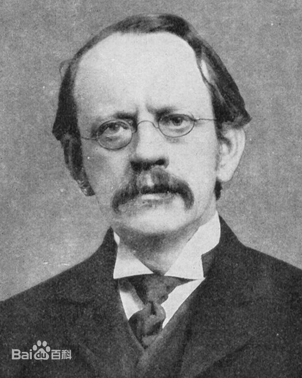

# 1856-1940 汤姆逊 Thomson

汤姆逊领导卡文迪什实验室的35年中间，实验室的研究工作取得了如下成果：进行了气体导电的研究，从而导致了电子的发现；放射性的研究，导致了α射线、β射线的发现；进行了正射线的研究，发明了质谱仪，从而导致了同位素的研究；膨胀云室的发明，为核物理和基本粒子的研究准备了条件；电磁波和热电子的研究导致了真空管的发明和改善，促进了无线电电子学的发展和应用。

他还在一篇关于能量转换的论文中指出，能量必须同时具有质量和动量，从而部分地预见到运动的带电粒子的波粒二象性和爱因斯坦质能关系式$E=mc^2$。

1883年，汤姆逊写了一篇与原子核有关的涡旋环理论的获奖论文，并由此开始了他的气体放电的实验研究。他称X射线使气体导电的现象为"电离"，并通过电离现象的研究证实了阴极射线是很小的带电粒子。

1897年，汤姆逊仔细地测量了这些阴极射线的磁偏转以及单位电荷传输的加热效应，分别给出了上述带电粒子的电荷与质量之比 $\frac e m$ 和电荷与动能之比 $\frac {e}{mv^2}$ ，从而定出了这种粒子的荷质比 $\frac e m$ 和速度v。他发现这种粒子的荷质比约为法拉第发现的最轻原子的荷质比的2000倍，从而首先提供了电子存在的直接证据。随后，他又在卡文迪什实验室进行的电磁场偏转实验和威尔逊云室的径迹观察中最终确认了电子，从而确定所有物质至少都包含电子这种共同的成分。1899年，汤姆逊使用威尔逊云室测量了电子的电荷和质量。汤姆逊和威尔逊测到的电子的电荷是 $1\times10^{-19}$ 库，质量在 $10^{-31}$ 千克量级。

汤姆逊当时称电子为“corpuscles”，然而而后的学界多使用“electron”称呼电子，这个词由约翰斯通·斯通尼（Johnstone Stoney）于1891年提出，早于汤姆逊实际发现电子。

汤姆逊还提出了原子的“葡萄干布丁原子结构模型”（又名汤姆孙模型），但后来的实验证实了这个模型是不正确的。另外，汤姆逊在研究了原子中的电子对X射线的散射后，结合巴克拉的结果，证明了原子中的电子数目约为原子质量数的一半，指出了原子序数的重要性。