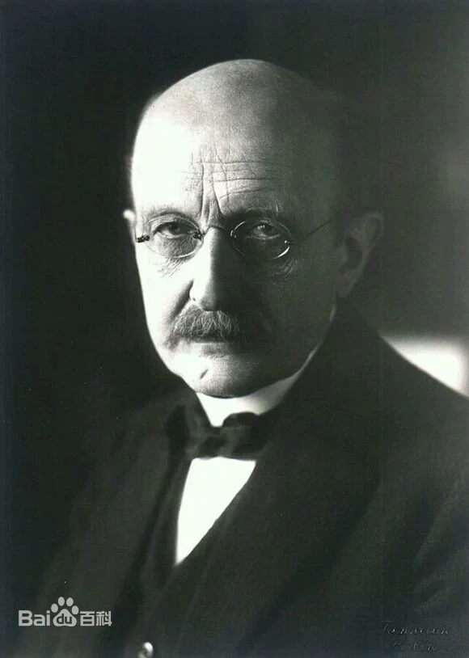
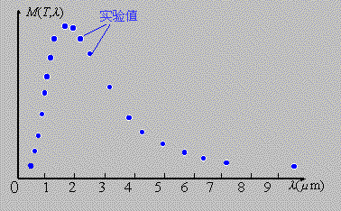

# 1858-1947 普朗克 Planck

 

 1896年，马克斯·普朗克开始对热辐射进行了系统的研究。期间为了解决瑞利-金斯公式只在低频范围符合，而维恩公式（维恩位移定律）只在高频范围符合，1899年，马克斯·普朗克提出了“基础无序原理”（principle of elementary disorder），并把瑞利-金斯定律和维恩位移定律这两条定律使用一种熵列式进行内插，可以很好地描述测量结果。

 

黑体辐射研究

  

 1900年10月下旬，马克斯·普朗克在《德国物理学会通报》上发表一篇只有三页纸的论文，题目是《论维恩光谱方程的完善》，第一次提出了黑体辐射公式。12月14日，在德国物理学会的例会上，他作了《论正常光谱中的能量分布》的报告，在报告中指出，为了从理论上得出正确的辐射公式，必须假定物质辐射（或吸收）的能量不是连续地、而是一份一份地进行的，只能取某个最小数值的整数倍，这个最小数值就叫能量子，能量的最小数值表示为：

$$ \varepsilon=hv $$

该公式称为普朗克辐射公式或普朗克定律，其中，ν是辐射频率，h被马克斯·普朗克叫做基本作用量子，后来被命名为普朗克常数。

$$ h=6.626196\times10^{-34}J\cdot s $$

1906年，马克斯·普朗克在《热辐射讲义》一书中系统地总结了他的工作，为开辟探索微观物质运动规律新途径提供了重要的基础。

量子假说

1900年，马克斯·普朗克提出了能量量子化。受他的启发，阿尔伯特·爱因斯坦于1905年提出在空间传播的光也不是连续的，而是一份一份的，每一份叫一个光量子，简称光子，光子的能量E跟光的频率v成正比，即

$$ E=hv $$

这个学说以后就叫光量子假说。