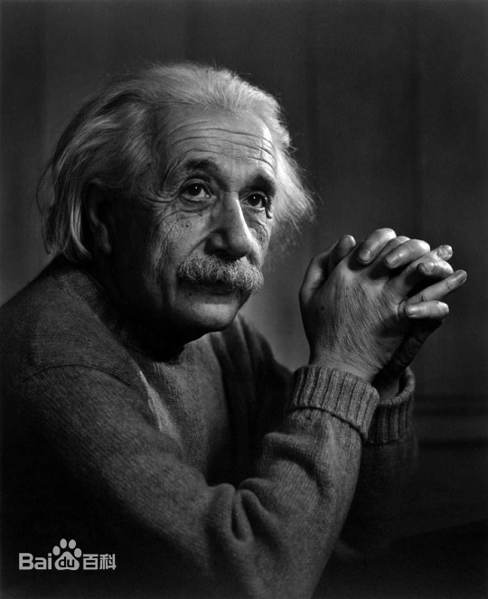

# 1879-1955 爱因斯坦 Einstein

阿尔伯特·爱因斯坦（德语/英语：Albert Einstein；1879年3月14日—1955年4月18日）

美国和瑞士双国籍的犹太裔物理学家。

1905年，爱因斯坦获苏黎世大学物理学博士学位，并提出光子假设、成功解释了光电效应（因此获得1921年诺贝尔物理学奖）；同年创立狭义相对论，1915年创立广义相对论，1933年移居美国。

光照射到金属上，引起物质的电性质发生变化。这类光变至电的现象被人们统称为光电效应（Photoelectric effect）。

电效应分为光电子发射、光电导效应和光生伏特效应。前一种现象发生在物体表面，又称外光电效应。后两种现象发生在物体内部，称为内光电效应。

赫兹于1887年发现光电效应，爱因斯坦第一个成功的解释了光电效应（金属表面在光辐照作用下发射电子的效应，发射出来的电子叫做光电子）。光波长小于某一临界值时方能发射电子，即极限波长，对应的光的频率叫做极限频率。临界值取决于金属材料，而发射电子的能量取决于光的波长而与光强度无关，这一点无法用光的波动性解释。还有一点与光的波动性相矛盾，即光电效应的瞬时性，按波动性理论，如果入射光较弱，照射的时间要长一些，金属中的电子才能积累住足够的能量，飞出金属表面。可事实是，只要光的频率高于金属的极限频率，光的亮度无论强弱，光子的产生都几乎是瞬时的，不超过十的负九次方秒。正确的解释是光必定是由与波长有关的严格规定的能量单位（即光子或光量子）所组成。

光电效应里，电子的射出方向不是完全定向的，只是大部分都垂直于金属表面射出，与光照方向无关，光是电磁波，但是光是高频震荡的正交电磁场，振幅很小，不会对电子射出方向产生影响。

## 光子说 光电效应方程

1905年，爱因斯坦把普朗克的量子化概念进一步推广。他指出：不仅黑体和辐射场的能量交换是量子化的，而且辐射场本身就是由不连续的光量子组成，每一个光量子的与辐射场频率之间满足ε=hν，即它的能量只与光量子的频率有关，而与强度（振幅）无关。

光子说：在空间传播的光不是连续的，而是一份一份的，每一份叫做一个光子，光子的能量跟它的频率成正比

如果入射光子的能量hν 大于逸出功 $W_0$ ，那么有些光电子在脱离金属表面后还有剩余的能量，也就是说有些光电子具有一定的动能。因为不同的电子脱离某种金属所需的功不一样，所以它们就吸收了光子的能量并从这种金属逸出之后剩余的动能也不一样。由于逸出功W0指从原子键结中移出一个电子所需的最小能量，所以如果用Ek 表示动能最大的光电子所具有的动能，那么就有下面的关系式

$$E_k=hv-W_0$$

其中h为普朗克常量，ν为入射光频率，$W_0$ 为逸出功。

## 狭义相对论

https://www.zhihu.com/question/66738900

    点评：
    
    麦克斯韦没有说过光速相对所有参考系是恒定的。

    迈克尔逊－莫雷实验的前提是以太是静止的，地球表面相对以太有以太风，这个提前是错的。所以不能证明以太不存在。

    光速不随参考系变化是狭义相对论的一个基本假设，任何用狭义相对论来解释为什么光速不变的都是耍流氓。

    相对论的前提条件不能成立，所以相对论是不对的。

早在16岁时，爱因斯坦就从书本上了解到光是以很快速度前进的电磁波，与此相联系，他非常想探讨与光波有关的所谓以太的问题 。“以太”这个名词源于希腊，用以代表组成天上物体的基本元素。17世纪的笛卡尔和其后的克里斯蒂安·惠更斯首创并发展了以太学说，认为以太就是光波传播的媒介，它充满了包括真空在内的全部空间，并能渗透到物质中。与以太说不同，牛顿提出了光的微粒说。牛顿认为，发光体发射出的是以直线运动的微粒粒子流，粒子流冲击视网膜就引起视觉。18世纪牛顿的微粒说占了上风，19世纪，光是波动说占了绝对优势。以太的学说也大大发展：波的传播需要媒质，光在真空中传播的媒质就是以太，也叫光以太。与此同时，电磁学得到了蓬勃发展，经过麦克斯韦、赫兹等人的努力，形成了成熟的电磁现象的动力学理论——电动力学，并从理论与实践上证明光就是一定频率范围内的电磁波，从而统一了光的波动理论与电磁理论。以太不仅是光波的载体，也成了电磁场的载体。直到19世纪末，人们企图寻找以太，然而从未在实验中发现以太，相反，迈克耳逊莫雷实验却发现以太不太可能存在。

电磁学的发展最初也是纳入牛顿力学的框架，但在解释运动物体的电磁过程时却发现，与牛顿力学所遵从的相对性原理不一致。按照麦克斯韦理论，真空中电磁波的速度，也就是光的速度是一个恒量；然而按照牛顿力学的速度加法原理，不同惯性系的光速不同。例如，两辆汽车，一辆向你驶近，一辆驶离。你看到前一辆车的灯向你靠近，后一辆车的灯远离。根据伽利略理论，向你驶来的车将发出速度大于c（真空光速3.0x10^8m/s）的光，即前车发出的光的速度=光速+车速；而驶离车发出的光的速度小于c，即后车发出的光的速度=光速-车速。但按照麦克斯韦理论，这两种光的速度相同，因为在麦克斯韦的理论中，车的速度有无并不影响光的传播，说白了不管车子怎样，光速等于c。

爱因斯坦似乎就是那个将构建崭新的物理学大厦的人。爱因斯坦认真研究了麦克斯韦电磁理论，特别是经过赫兹和洛伦兹发展和阐述的电动力学。爱因斯坦坚信电磁理论是完全正确的，但是有一个问题使他不安，这就是绝对参照系以太的存在。他阅读了许多著作发现，所有人试图证明以太存在的试验都是失败的。经过研究爱因斯坦发现，除了作为绝对参照系和电磁场的荷载物外，以太在洛伦兹理论中已经没有实际意义。

爱因斯坦喜欢阅读哲学著作，并从哲学中吸收思想营养，他相信世界的统一性和逻辑的一致性。在“奥林匹亚科学院”时期大卫·休谟（David Hume）对因果律的普遍有效性产生的怀疑，对爱因斯坦产生了影响。相对性原理已经在力学中被广泛证明，但在电动力学中无法成立，对于物理学这两个理论体系在逻辑上的不一致，爱因斯坦提出了怀疑。他认为，相对性原理应该普遍成立，因此电磁理论对于各个惯性系应该具有同样的形式，但在这里出现了光速的问题。光速是不变的量还是可变的量，成为相对性原理是否普遍成立的首要问题。当时的物理学家一般都相信以太，也就是相信存在着绝对参照系，这是受到牛顿的绝对空间概念的影响。19世纪末，马赫在所著的《发展中的力学》中，批判了牛顿的绝对时空观，这给爱因斯坦留下了深刻的印象。1905年5月的一天，爱因斯坦与一个朋友贝索讨论这个已探索了十年的问题，贝索按照马赫主义的观点阐述了自己的看法，两人讨论了很久。突然，爱因斯坦领悟到了什么，回到家经过反复思考，终于想明白了问题：时间没有绝对的定义，时间与光信号的速度有一种不可分割的联系。他找到了开锁的钥匙，经过五个星期的努力工作，爱因斯坦把狭义相对论呈现在人们面前。

1905年6月30日，德国《物理学年鉴》接受了爱因斯坦的论文《论动体的电动力学》，在同年9月的该刊上发表。这篇论文是关于狭义相对论的第一篇文章，它包含了狭义相对论的基本思想和基本内容。狭义相对论所根据的是两条原理：相对性原理和光速不变原理。爱因斯坦解决问题的出发点，是他坚信相对性原理。伽利略最早阐明过相对性原理的思想，但他没有对时间和空间给出过明确的定义。牛顿建立力学体系时也讲了相对性思想，但又定义了绝对空间、绝对时间和绝对运动，在这个问题上他是矛盾的。而爱因斯坦大大发展了相对性原理，在他看来，根本不存在绝对静止的空间，同样不存在绝对同一的时间，所有时间和空间都是和运动的物体联系在一起的。对于任何一个参照系和坐标系，都只有属于这个参照系和坐标系的空间和时间。对于一切惯性系，运用该参照系的空间和时间所表达的物理规律，它们的形式都是相同的，这就是相对性原理，严格地说是狭义的相对性原理。在这篇文章中，爱因斯坦没有讨论将光速不变作为基本原理的根据，他提出光速不变是一个大胆的假设，是从电磁理论和相对性原理的要求而提出来的。这篇文章是爱因斯坦多年来思考以太与电动力学问题的结果，他从同时的相对性这一点作为突破口，建立了全新的时间和空间理论，并在新的时空理论基础上给动体的电动力学以完整的形式，以太不再是必要的，以太漂流是不存在的。

一般来说，大众会通过信号来确认相对性。为了得知异地事件的同时性就得知道信号的传递速度，但必须测出两地的空间距离以及信号传递所需的时间，空间距离的测量很简单，麻烦在于测量时间，我们必须假定两地各有一只已经对好了的钟，从两个钟的读数可以知道信号传播的时间。但要知道异地的钟是否对好，就还需要一种信号。如果按照先前的思路，它又需要一种新信号，这样无穷后退，异地的同时性实际上无法确认。不过有一点是明确的，同时性必与一种信号相联系，否则我们说这两件事同时发生是无意义的。

光信号可能是用来对时钟最合适的信号，但光速非无限大，这样就产生一个新奇的结论，对于静止的观察者同时的两件事，对于运动的观察者就不是同时的。我们设想一个高速运行的列车，它的速度接近光速。列车通过站台时，甲站在站台上，有两道闪电在甲眼前闪过，一道在火车前端，一道在后端，并在火车两端及平台的相应部位留下痕迹，通过测量，甲与列车两端的间距相等，得出的结论是，甲是同时看到两道闪电的。因此对甲来说，收到的两个光信号在同一时间间隔内传播同样的距离，并同时到达他所在位置，这两起事件必然在同一时间发生，它们是同时的。但对于在列车内部正中央的乙，情况则不同，因为乙与高速运行的列车一同运动，因此他会先截取向着他传播的前端信号，然后收到从后端传来的光信号。对乙来说，这两起事件是不同时的。也就是说，同时性不是绝对的，而取决于观察者的运动状态。这一结论否定了牛顿力学中引以为基础的绝对时间和绝对空间框架。

相对论认为，光速在所有惯性参考系中不变，它是物体运动的最大速度。由于相对论效应，运动物体的长度会变短，运动物体的时间膨胀。但由于日常生活中所遇到的问题，运动速度都是很低的（与光速相比），看不出相对论效应。

爱因斯坦在时空观的彻底变革的基础上建立了相对论力学，指出质量随着速度的增加而增加，当速度接近光速时，质量趋于无穷大。他并且给出了著名的质能关系式：E=mc^2，质能关系式对后来发展的原子能事业起到了指导作用。

