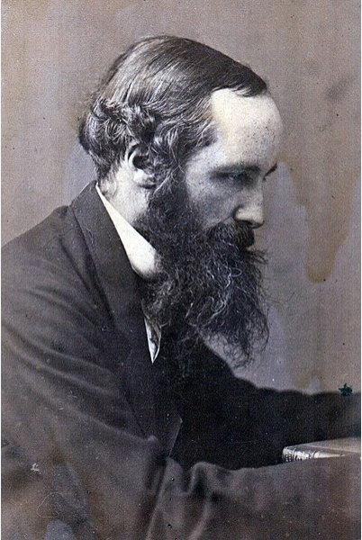

# 1831-1879 麦克斯韦 Maxwell

詹姆斯·克拉克·麦克斯韦 FRS FRSE（英语：James Clerk Maxwell；1831年6月13日—1879年11月5日）

- 事迹1：总结前人特别是法拉第的研究成果，用数学方式建模了电磁模型
- 事迹2：用数学方法证明以太模型和超距场模型数学结果一致，给出了基于以太的“动态电磁场理论”
- 事迹3：预测电磁波的存在

《动态电磁场理论》《电磁通论》

麦克斯韦精心研究了法拉第的"力线"概念，在1855年发表了第一篇电磁学论文------《论法拉第的力线》。通过数学方法，他把电流周围存在磁力线的特征，概括为一个矢量微分方程，导出了法拉第的结论。

在研究电和磁的关系中，以前一直认为电流产生磁场，这个电流是指传导电流，法拉第也是这样认为的。麦克斯韦在实验中有了新的发现。

把两块中间夹着介质的金属板，也即是电容器，接在交变电源上，介质内并不存在自由电荷，也就是没有传导电流，但磁场却同样存在。

这个磁场是怎样产生的呢？麦克斯韦经过研究和分析，认为这里的磁场是由另一种类型的电流产生的，这种电流存在于任何电场变化的电介质中。他把这种电流称为"位移电流"，指出在位移电流的周围空间同样产生磁场，这种磁场和传导电流产生的磁场完全一样。

1862年，麦克斯韦发表了《论物理力线》的论文。这篇论文是他在电磁学理论方面的第二篇论文，已经不再是法拉第观点的数学翻译了，而是有了重大的引申和发展，首创了"位移电流"的新概念，指出不仅变化的磁场产生电场，而且变化的电场也产生磁场。

在这篇论文中，麦克斯韦还预见了电磁波的存在。在研究电场和磁场的交相变化过程时，他认识到这种相互变化的电磁场以波的形式向空间散布，由近及远。

他还对电磁学的定律进行了高度的概括，写出了数学方程，导出了电磁场的能量密度和电磁波的能量密度，指出电磁波就是能量的流动过程，从而说明了电磁波的物质性。

但是麦克斯韦并没有用实验来证实电磁波的存在。

1864年，麦克斯韦发表他的第三篇电磁学论文《电磁场的动力学理论》。在这篇论文里，麦克斯韦方程更完备了，它导出了电场与磁场的波动方程，其波的传播速度正好等于光的速度。这启发他提出了光的电磁学说，指出光也是一种电磁波，只不过是一种频率很低的电磁波，从而进一步认识了光的本质。

1873年，麦克斯韦出版了他的电磁学专著《电磁学通论》。

这部著作全面而系统地总结了电磁学研究的成果，成为电磁学的经典理论著作。这部著作的巨大意义，可与牛顿的《自然哲学数学原理》相媲美。如果说《自然哲学数学原理》是对经典力学的大综合，成为力学发展的里程碑，那么《电磁学通论》就是对电磁学的大综合，成为电磁学发展的里程碑。

在这部著作里，麦克斯韦以他特有的数学语言，建立了电磁学的微分方程组，揭示了电荷、电流、电场、磁场之间的普遍联系。这个电磁学方程，就是后来以他的名字著称的"麦克斯韦方程"。

麦克斯韦方程包括四个方面的内容：

1.法拉第感应定律； 2.描述电磁场对位移电流密度和传导电流密度的关系；
3.相当于库仑定律； 4.表明了除电源外，没有其他磁场源。

在《电磁学通论》中，电磁场、电磁波、光的电磁说都具有了严密的理论形态与数学模型，使电磁学发展到了高峰。

这样，一座宏伟的经典电磁学的理论大厦就由麦克斯韦建立起来了。

为了纪念他，人们把电磁单位制的磁通量单位定名为"麦克斯韦"。