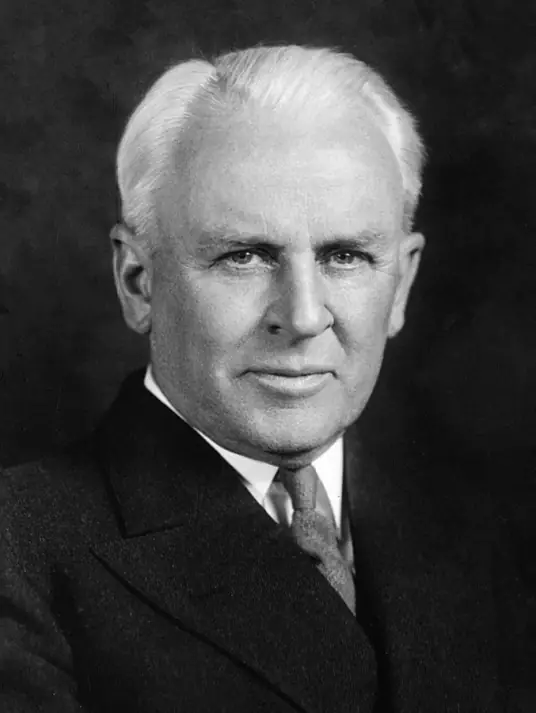

# 1868-1953 密立根 Millikan

罗伯特·安德鲁·密立根（Robert Andrews Millikan，1868年3月22日—1953年12月19日）

实验物理学家，美国艺术与科学院院士，美国国家科学院院士，1923年诺贝尔物理学奖得主。

精确测定基本电荷值

罗伯特·安德鲁·密立根最著名的实验成就是在电场和重力场中运动的带电油滴精确地测定了基本电荷。密立根的基本电荷实验是从云雾方法开始的。他先和研究生贝济曼（L. Begeman）一起重复了卡文迪什实验室的工作。密立根和贝济曼最初只是重复平板电极实验，结果没什么进步。后来改用镭作为电离剂，代替Ｘ射线，结果比平板电极法略好，得e=4.03×10-10esu（esu是cm·g·s静电单位制的缩写，1esu（电量）=1/3×10-9C）。1908年，密立根在美国物理学会年会上宣读电子电荷结果后得到欧内斯特·卢瑟福的肯定，后来密立根受到带电云雾法的启发，发明了水珠平衡法。1909年，密立根用水珠平衡法测量电子电荷，得e=4.65×10-10esu。1909年12月至1910年5月，密立根与他另一 名学生弗雷切尔（H. Fletcher）用油（或甘油和汞）做了近200颗的油滴的平衡实验。他们宣称，在所有情况下液滴从空气中捕获的电荷都是最小电荷的整数倍。综合所有数据，并对斯托克斯定律进行修正，得到电子电荷的平均值e=4.891×10-10esu。1910年以后，密立根在平衡油滴法的基础上，进一步改进了实验方法，并进一步研究斯托克斯定律的有效性，作了修正，1913年宣布油滴测定电子电荷实验完成，得到电子电荷的数值为e=（4.774±0.009）×10-10esu。