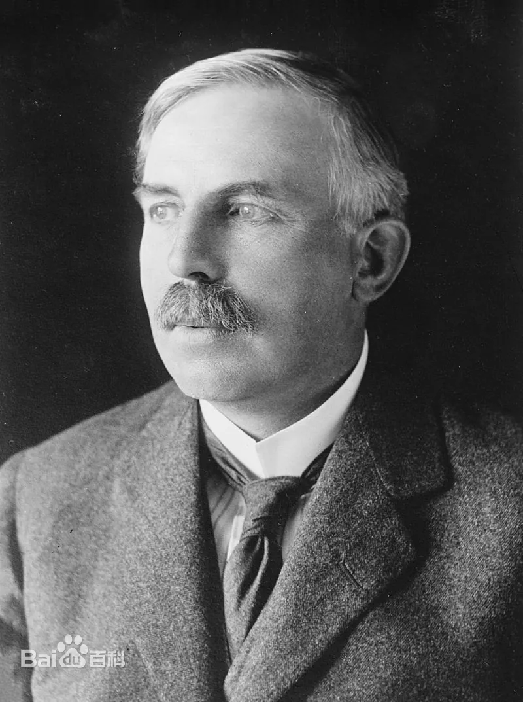

# 1871-1937 卢瑟福 Rutherford

欧内斯特·卢瑟福（Ernest Rutherford，1871年8月30日---1937年10月19日）

物理学家，纳尔逊男爵，英国皇家学会院士，诺贝尔化学奖获得者，生前是卡文迪许实验室主任。

欧内斯特·卢瑟福主要从事核科学和放射性方面的研究。

1898年，欧内斯特·卢瑟福报告了铀辐射中α射线和β射线的存在，并指出了它们的一些性质。并首先提出放射性半衰期的概念，证实放射性涉及从一种元素到另一种元素的嬗变。他又将放射性物质按照贯穿能力分类为α射线与β射线，并且证实前者就是氦离子。

1911年，欧内斯特·卢瑟福根据α粒子散射实验现象提出原子核式结构模型，创建了卢瑟福模型（行星模型）。

1919年，欧内斯特·卢瑟福做了用α粒子轰击氮核的实验。他从氮核中打出的一种粒子，并测定了它的电荷与质量，它的电荷量为一个单位，质量也为一个单位，卢瑟福将之命名为质子。

1932年，詹姆斯·查德威克（James Chadwick）在欧内斯特·卢瑟福的指导下发现了中子。