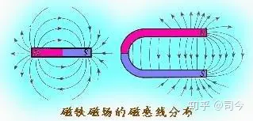
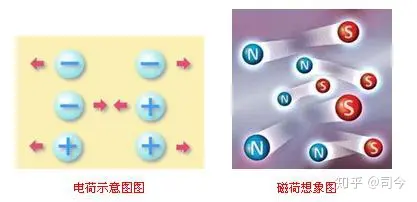
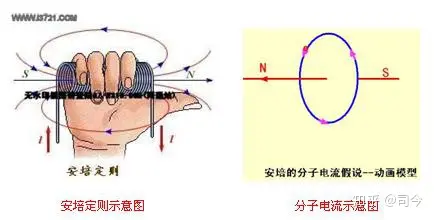
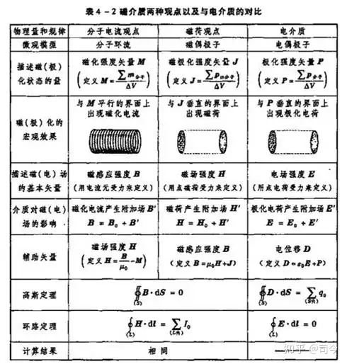
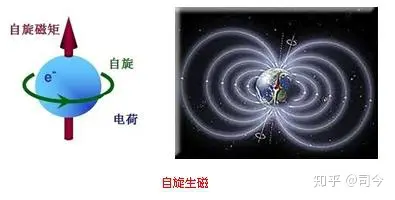
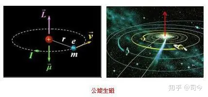
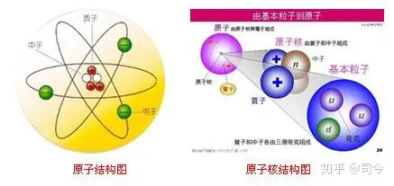
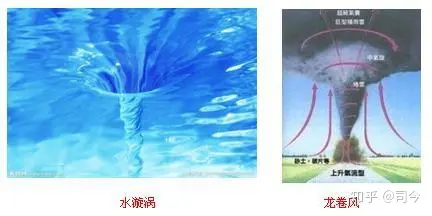
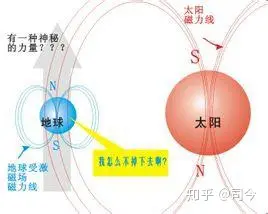
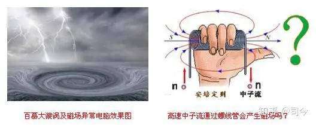

---

title: 磁陀螺运动与现代物理学漫谈（3）——说说磁性起源 - 知乎

date: 2024-05-12 14:37:17

categories: vortext

tags: 
- 无

original_url: https://zhuanlan.zhihu.com/p/71789739

---

# 磁陀螺运动与现代物理学漫谈（3）——说说磁性起源 - 知乎

**磁陀螺运动与现代物理学漫谈（3）——说说磁性起源**

**司** **今**（jiewaimuyu@126.com）

  

  

在磁物理学发展史中，关于磁性起源问题存在二种观点：最先出现的是库伦“磁荷”观点，后来安培提出了“分子电流”观点；这二种观点至今还深深地影响着现代物理学。

**1、磁荷观点**

库伦通过实验得出点电荷定理后，感觉磁体磁极之间的力也应存在平方反比关系，他用电偶极子作类比，将磁体看做是一个磁偶极子，在磁体二端各带有正、负磁荷（N极为正磁荷，S极为负磁荷），并用扭秤实验证明了库伦磁荷定理的存在；自此，人们就坚信大自然中一定存在像电荷一样可以独立、自由运动着的磁荷。

  

  

磁荷观点虽能与牛顿质点和点电荷思想保持一致，但它并不符合磁在大自然中存在的客观实际，即自然界磁性物质都呈偶磁极性，至今也没有真正发现能够独立存在的磁荷。

  

  

**2、分子电流观点**

法国学者安培受“通电螺线管外部磁场与条形磁铁磁场很相似”的启发，提出了分子电流假说；他认为，在原子、分子等物质微粒内部存在着一种环形电流——分子电流，分子电流使每个原子、分子等物质微粒都成为微小的磁体，它的两侧相当于两个磁极。

  

  

安培所处时代人们对物质内部为什么会有分子电流还不清楚，直到20世纪初，人们才知道所谓分子电流就是由原子内部电子运动形成的。

根据现在物质结构学说，任何物质（实物）都是由分子、原子组成的，而分子或原子中任何一个电子都在不停地同时参与两种运动，即绕原子核的公转运动和电子本身的自旋运动，这两种运动都等效于一个电流分布，因而它们能产生磁效应。把分子或原子看成一个整体，分子或原子中各个电子对外界所产生磁效应的总和，可以用一个等效的圆电流表示，统称为分子电流。这种分子电流具有一定的磁矩，称为分子或原子磁矩。

  

  

安培分子电流的假说能够揭示磁铁磁性的起源，它使我们认识到：**磁铁的磁场和电流的磁场一样，都是由电荷运动产生的．**

从分子电流观点出发，又衍生出了磁极化理论，如一根铁棒，在未被磁化时，内部各分子电流取向是杂乱无章的，它们的磁场互相抵消，对外界不显磁性；当铁棒受到外界磁场作用时，各分子电流的取向变得大致相同，铁棒被磁化，两端对外界显示出较强的磁作用，形成磁极。磁体受到高温或猛烈敲击会失去磁性，这是因为在激烈的热运动或机械振动的影响下，分子电流的取向又变得杂乱了。

  

  

今天，磁起源的分子电流观点因其能够完满地解释各种实验现象而得到了公认；而磁荷观点却因一直找不到磁单极而渐为人们所淡忘——其实这只是被人们遗忘的原因之一，另一个原因是人们无法知道荷是如何产生的？

但用磁荷观点建立起的一套理论，与电学理论具有明显的对称性，磁荷理论阐述的一系列定理、定律和公式，以及用它们所做的问题计算，不仅同样有效，而且有时更为简洁和便于记忆，究其根本原因就是，虽然至今没有发现磁单极，但磁偶极子确实存在。

现代物理学认为：磁偶极子实际就是一个小圆电流的等效模型，“电流说”与“磁荷说”两种理论观点正是通过“小电流环—磁偶极子”这个两重性模型被联系了在一起（见下对比表）。

  

  

但我觉得现代物理学的这种“联系”有一些“牵强”，且存在不合理性，因为“分子电流说”只能解释“公转”生磁效应，并不能解释“自旋”生磁效应——这是分子电流观点存在的最缺陷。

从“通电螺线管产生磁现象”与“安培分子电流观点”在解释磁化现象中较成功应用上来看，可以肯定这样一个事实：磁性起源一定与物质的旋转运动有关！当然，这种旋转运动应包括公转与自旋，即磁性起源应存在“公转生磁”和“自旋生磁”二个方面。

  

  

对电子公转可以产生磁，这一点好理解，但对电子自旋也可以产生磁，就不那么好理解了，因为到目前为止还没有发现自旋电子有内部组成结构（光子也是如此），那么，用“环绕原子核的运动和电子本身的自旋，这两种运动都等效于一个电流分布，因而能产生磁效应”的语言来解释“电子自旋磁效应”就显得苍白无理了；因此，只有承认“自旋生磁效应”也存在，这个问题才能得以妥善解释；也就是说，磁性起源应包括二个方面：（1）公转生磁，（2）自旋生磁。

  

  

但现代物理学只一味地强调用分子电流观点（即公转生磁）去认识磁性起源，这就深深掩盖了“自旋生磁”现象的存在，它留给量子力学关于“自旋磁矩”起源的论述只能用“内禀”一词去“挡驾”了。量子力学用“内禀”性（内禀：存在但并不彰显，或不为人知）来诠解“自旋磁矩”起源问题，这显然是一种逃避磁起源本质探索的懒惰做法。

从系统论角度来看，自旋应有二种概念：

（1）、真自旋，也称刚体自旋，从宏观刚体而言，地球自旋就可以近似地看做是一种刚体自旋；从微观角度而论，没有内部组成结构的最基本粒子或具有近似刚体性的原子核等均可以看做是一种刚体自旋，如质子、中子、电子、光子等。

  

  

刚体自旋产生的磁效应可以用公式qm=mω来描述，即对一个自旋刚体而言，其自旋磁量的大小是由其质量m和自旋角速度ω共同决定的；如中子星体积小，但因m、ω大，故其表现出的磁性就强；再如，金星质量m比火星大，但其自旋角速度ω却比火星小，即：

q金=mω=4.83×1024×2π∕243×24＜q火=mω=6.4×1023×2π∕24.6.

故金星表现的磁场性就比火星要弱。

（2）、假自旋，也称非刚体自旋，即表示内、外层旋转有明显的不连续差异，如流体自旋、复合粒子(如原子、分子)自旋等。

  

  

  

对复合粒子自旋而言，它实质上是一种空间公转现象，如我们通常所说的氢原子自旋指的就是自旋电子绕氢原子核公转所表现出来的一种空间旋转现象，由于氢原子系统不是刚体，它无法做整体自旋，故称之为假自旋。

  

  

对一个假自旋系统，它的自旋磁量大小可以用公式qm=mΩ来描述，如氢原子的自旋磁量就是氢原子核外电子公转时所表现出来的磁量大小，即q氢原子=meΩe；再如，我们在测量银原子磁矩时，用其核外电子轨道磁矩的大小来表示整个银原子的自旋磁矩就是这个原因——具体论述可参阅司今《物质自旋与力的形成》、《磁子论》等文章。

  

  

从qm=mΩ、qm=mω公式来看，磁的产生不仅仅只与电子运动有关，任何一种粒子只要有公转或自旋运动就都会产生磁现象；但是，我们现在被“分子电流观点”紧紧束缚着，一提到磁就会想到与电子运动联系起来，就从没有人敢去追问“非电性粒子流通过螺线管会产生磁性吗”、“非电性物体自旋也会有自旋磁矩存在吗”等开拓性问题。

电子在金属导线中的流速高达104m/s，抛开磁与电联系思想，如果我们用104m/s的高速中性粒子流，如水分子、中子流等通过螺线管，这个螺线管外会产生磁场吗？（信息来源：

[http://blog.sina.com.cn/s/blog\_d288bb3b0102v8zx.html](https://link.zhihu.com/?target=http%3A//blog.sina.com.cn/s/blog_d288bb3b0102v8zx.html)）。

我曾试做过此实验，但因水流太小，没有能够产生明显的磁效应；但我们从龙卷风、海洋漩涡（百慕大漩涡）的观测中可以发现，在这些大型漩涡上空都会出现磁异常现象，虽然空气、水转速不高，但它们有大质量参与，依据旋转体磁量公式qm =mΩ来推断，它们依然可以产生明显的磁效应。

  

  

现在，已有一些研究机构在关注和研究“高速粒子流通过螺线管能不能产生磁场”问题；如在2000年，欧洲的两个研究团队—一个由拉脱维亚大学的AgrisGailitis领导，另一个由德国卡尔斯鲁厄研究中心的RobertStieglitz和UlrichMuller以及德国拜伊特大学的FritzBusse组成，他们都独立地实现了在大量的液钠里自己产生磁场的试验（采用液钠是因为钠具有良好的导电性和低熔点性）；这两个研究团队都找到了在1到2米长的螺旋型管道系统中获得高速流体的方法，实现了在实验室通过流体发动机产生连续磁场的梦想（信息来源：[http://www.docin.com/p-320055798.html](https://link.zhihu.com/?target=http%3A//www.docin.com/p-320055798.html)）。

【参考文献】略

**【注】：**

1、本文所用图片除作特别说明和自我绘制外，均来自「百度图片」，在此对「百度」网表示感谢！

2、特别声明：如其他媒体、网站或个人从本博转载此文，须保留本博“地址”，否则视为侵权行为。

