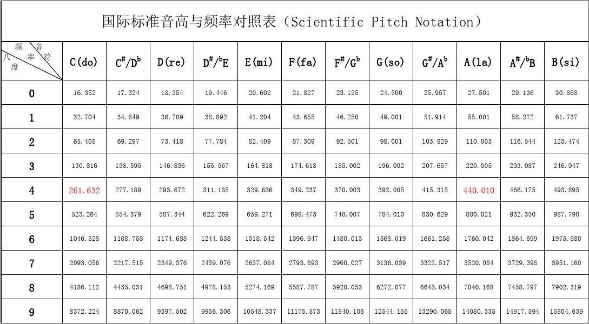

# 乐理基础概念

声音包含了三方面的内容：声音的振幅，即音频的强度或幅度；声音的频率，即音频的频率或每秒变化的次数 ；声音的音色，即由泛音来决定。

- 音调：pitch
- 音色：tone colour; timbre; belch timbre; tone

正常情况下，人耳听力频率范围是20赫兹到20000赫兹，最敏感的声音频率在1000赫兹到3000赫兹。

## 音程（Interval）

音程（Interval）是两个乐音之间的音高关系，通过“度”数和音数确定。“度”是一种人为规定的单位，用来衡量音与音之间的“距离”。

## 音调(音高)（Pitch）

音高（Pitch），是指各种音调高低不同的声音，即音的高度，音的基本特征的一种。

声的本质是机械波，所以声速一定时，音的高低是由机械波的频率和波长决定的。频率高、波长短，则音"高"，反之，频率低、波长长，则音"低"。

音高是声音的三大特征之一，区别于音强和音色，音调高只能表示音的频率高和波长短，不能表示振幅大和音强强。

声音频率的高低叫做音调（Pitch），是声音的三个主要的主观属性，即音量（响度）、音调、音色（也称音品） 之一。表示人的听觉分辨一个声音的调子高低的程度。音调主要由声音的频率决定，同时也与声音强度有关。对一定强度的纯音，音调随频率的升降而升降；对一定频率的纯音、低频纯音的音调随声强增加而下降，高频纯音的音调却随强度增加而上升。

大体上，500 赫兹以下的低频纯音的音调随响度的增加而下降，1500 赫兹以上高频纯音的音调随响度的增加而上升。

对音调可以进行定量的判断。音调的单位称为美（mel）：取频率1000赫兹、声压级为40 分贝的纯音的音调作标准，称为1000 美，另一些纯音，听起来调子高一倍的称为2000 美，调子低一倍的称为500 美，依此类推，可建立起整个可听频率内的音调标度。这样得到的声压级40 分贝的纯音音调与频率的关系见下表：

音调高：空灵，清凉，纤细

音调低：雄浑，澎湃，粗犷

乐音（复音）的音调更复杂些，一般可认为主要由基音的频率来决定。

纯音的音调表：

| 频率f/Hz | 音调/mel | 频率/fHz | 音调/mel |
|----------|----------|----------|----------|
| 20       | 0        | 900      | 929      |
| 30       | 24       | 1000     | 1000     |
| 40       | 46       | 1250     | 1154     |
| 60       | 87       | 1500     | 1296     |
| 80       | 126      | 1750     | 1428     |
| 100      | 161      | 2000     | 1545     |
| 150      | 237      | 2500     | 1771     |
| 200      | 301      | 3000     | 1962     |
| 250      | 358      | 3500     | 2116     |
| 300      | 409      | 4000     | 2250     |
| 350      | 460      | 5000     | 2478     |
| 400      | 508      | 6000     | 2657     |
| 500      | 602      | 7000     | 2800     |
| 600      | 690      | 10000    | 3075     |
| 700      | 775      |          |          |
| 800      | 854      |          |          |

## 音强

声音的强度是一个客观的物理量，其常用单位为“分贝（db）”。

在音乐体系中，音的强弱是由机械波振幅的大小决定的，两者成正比关系，振幅越大则音越"强"，反之则越"弱"。音乐作品中的强弱变化叫做"力度"，用文字或符号来标明，如f（强）、p（弱）等。

## 和声(泛音)(Harmonics)

泛音，英文称为Harmonics

除了发音体整体产生的波长最长的音是基音，以基音为标准，物体的各部分（二分之一，三分之一，四分之一……等）产生的是泛音，泛音的波长通常为基音的整数分之一（如λ/2，λ/3，λ/4......等）。

泛音列的描述：所有音列中波长最长者称为基本波长（基波），而基波长短决定了乐器弹奏此音符的音高。几乎所有乐器除了可发出基波音以外亦会伴随着较短波的声音，称为泛音。在有明显音高的乐器中，弦或空气管之间会有因反射而造成波长相同、行进方向相反的波，而因为这些彼此互相干涉而产生波长不同的谐波，在音乐上的名词即为泛音。而泛音列的波长分别为弦长或是空气管长的1/2、1/3、1/4、1/5、1/6、...等倍。参考驻波可了解其原理。

理论上，泛音的波长分别为基波的1/2、1/3、1/4、1/5、1/6、...等倍。但是根据介质的物体特性，空气介质往往会改变原先泛音的波长。然而，这些特性除了对波长的精确度有影响外，听觉上的影响甚小。因此可合理地说泛音的波长为基波的整数分之一。

## 八度

因为八度之间为二倍关系，人耳听力频率范围是20赫兹到20000赫兹，2的10次方为1024，最多为2的9次方512，所以音乐中的八度最多有9个。

## 十二平均律

## 音色（Timbre）

音色（Timbre），物理学术语，是指不同声音表现在波形方面总是有与众不同的特性，不同的物体振动都有不同的特点。

音色是声音的属性（即响度、音调、音色）之一，主要由其泛音决定。每个人的声音以及各种乐器所发出的声音的区别，就是由音色不同造成的。

初中物理学教材规定，声音的品质叫做音色，又叫音品，它反映了每个物体发出的声音特有的品质。

音色又称为音品。为什么音色不同？是由于不同的振动总是可组合成为不同的声音。每一种乐器、不同的人的声带，以及其它所有的能振动的物体都能够发出各有特色的不同的声音，这些声音的还可以有仪器显示出波形。声音除了有一个‘基音’外，还自然而然加上许多不同‘频率’（振动的物体1秒钟振动的次数）与泛音‘交织’，就决定了不同的音色，使人听了以后能辨别出是不同的声音，如同区分不同的“身份证”一样。例如你听见某一个人的讲话声或者唱歌声音就可判断是哪一个人。世界上每一个人即使念相同的一个字“呵”也有不同的音色。

声音是由发声的物体振动产生的，当物体振动时会发出基音，同时其各部分也有复合的振动，各部分振动产生的声音组合成泛音。所有的不同的泛音都比基音的波长短，且强度都相当弱，所以它盖不过比较强的基音，音乐家就可以调准乐器的音高。

音色比喻为‘调色盘产生的东西’，其种类是几乎无穷无尽的，能直接触动听觉感官。

概括地说，音色=纯音+变换+混合方式。

音色的作用是巨大的，其种类可以以下公式阐述：

1. 声音=乐音+噪音
2. 乐音=源音+节拍
3. 源音=音调+响度+音色
4. 音色=纯音+变换+混合方式

具体的来说，音色的类型，是由振源的特性和共振峰的形状共同决定的。就振源来说，泛音强度衰减快，音色就很柔和，例如人声和弦乐器；泛音强度衰减慢，音色就很坚硬，例如木管乐器(特别是双簧管和萨克斯管)。就共鸣腔来说，共振峰出现在较低的频率上，音色就雄壮，例如小号；共振峰出现在较高的频率上，声音就冰凉，例如钢琴。某些音色具有多种特性，例如人声的音色既柔和又圆润，小号的音色既雄壮又坚硬，圆号同时具有雄壮和圆润的音色。

由单个泛音构成的音，只呈现出一个峰。只发出泛音的乐器是不存在的，泛音只能依靠软件来产生。（‘音叉’也可以，类似于蚊子的声音）然而任何普通的音色都由若干泛音组成，这些泛音的频率都是某个泛音频率的倍数，这个泛音称为基音，也称第一泛音，比它高的泛音依次称为第二泛音、第三泛音，等等。例如，钢琴上的‘复音’c1频率为261.6 Hz，那么这个音就应该有以下的’泛音‘组合成。

- 泛音 1 2 3 4 5 6 7 * 8 9 10 11 * 12
- 频率 261.6 523.2 784.8 1831 2878 3139
- 音高 c1 c2 g2 c3 e3 g3 #a3 c4 d4 e4 #f4 g4

### GM音色列表

GM:General MIDI system Level1即通用MIDI标准系统第一级（General MIDI system Level1），制定于1991年。在GS标准基础上，规定了MIDI设备的最大同时发音数不得少于24个、鼓镲等打击乐器作为一组单独排列、128种乐器音色有统一的排列方式等。GM的音色排列方式基本上沿袭了GS标准。它一推出便得到了全球MIDI厂商的一致支持,实现了MIDI设备间的交流。

