---

date: 2024-05-12 14:28:56

categories: vortext

tags: 
- 无

original_url: https://zhuanlan.zhihu.com/p/70428989

---

# 磁陀螺运动与现代物理学漫谈（2）——我们该如何研究磁陀螺运动？

## **磁陀螺运动与现代物理学漫谈（2）——我们该如何研究磁陀螺运动？**

**司** **今**（jiewaimuyu@126.com）

物理学主要是研究物质在时空中运动及其相关概念的科学，它包括能量、动量和作用力；更广义说，物理学是对大自然运动现象研究的综合与分析，目的是为了寻求和阐述宇宙间物质运动所应遵循的规律。

物理学研究领域的基本组成要素是质量、能量、空间、时间及其相互作用力；常采用基本定律与法则来完成理论逻辑系统。

**物理学理论研究常用的方法有：**

模型法：如对原子结构的认识和研究就须建立一个物理模型，如卢瑟福理论中的“行星结构模型”等。

类比法：如电磁学中，用电场的一些属性和定义去描述磁场的方法就是如此。

实验法：如电磁学中，库伦电荷和磁荷定理等是通过实验得来的。

等效法：如麦克斯韦在解读法拉第力线与场时，就采用水流模型来说明和定量电流。

转换法：如在电磁学中，高斯定理所描述的磁感应强度就是将库伦磁定理所定义的磁场强度转化成了用磁力线面密度来描述。

推理法：如麦克斯韦通过LC振荡现象，提出位移电流存在，并进一步推理出电磁波存在。

猜想法：表面上看，它与推理法相近，但本质不同，因推理是建立在一定理论基础之上的“猜想”；而猜想法只是根据现象做出的“推断”，并不能从理论上给予清晰说明，如“波粒二象性”就是用“猜想法”给出的结论。

当然，一种理论的建立并不是孤立地只用一种方法，常常是多种方法的组合，如原子结构理论就必然包含以实验为基础的库伦定理和圆周运动理论。

这里要特别强调一下“物理模型”问题：任何一个物理理论的建立都必须直接或间接地建立一个清晰的物理模型。

同时，物理模型会随理论的变化而变化，如，原子结构模型，历史上先后有汤姆逊的“蛋糕+葡萄干”模型、卢瑟福的“行星结构”模型，玻尔的“自旋行星结构”模型等，不同模型所产生的理论是不一样的；如何甄别模型的正确性呢？实验，只有实验！卢瑟福就是用原子核散射实验否定了汤姆逊模型，然后建立了自己的物理模型和理论物理；玻尔则通过对“紫外线灾难”的分析，否定了卢瑟福模型，推出自己的物理模型和量子理论；可见，物理模型在物理学理论研究中占有极其重要的位置。

  

  

  

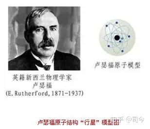

  

  

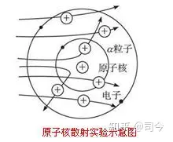

  

  

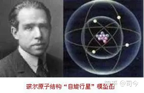

  

  

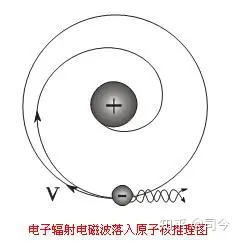

  

**物理学理论研究的步骤一般为：**

1、观察现象，包括对自然现象和实验现象的观察等，通过多次观察、实验以确定此现象有没有规律可循。

2、思考分析，利用现有的相关物理理论对所观测或实验的现象或事物做一抽象思考，剔除无关因素，确立主要因素，为建立理论规律作准备。

3、建立理论，包括物理模型、定量描述、推理预测等组成结构形式，对此可用归纳、演绎、类比或归谬等推理形式，但逻辑推理过程要严谨、自洽。

4、验证理论，用新实验对你建立的理论或结论做以验证.。

5、升华理论：重复1—4步骤，直到得出能够比较符合观察或实验描述实际的正确理论或结论为止。

**那么，对于磁陀螺运动，我们该去如何研究呢？**

我想也不外上述几个步骤，即：首先在磁场中做磁陀螺运动实验，然后分析影响磁陀螺运动变化的主要因素，再确立磁陀螺在磁场中运动的理论模型，再在上述实验基础上改变实验方法、方式，对已确立的理论或结论加以验证、补充和完善……

不过，磁陀螺运动不同于一般的陀螺运动，因为它除了具有一般陀螺运动特点外，还有磁场，因此说，磁陀螺运动问题既属于经典牛顿刚体力学范畴，同时又属于场物理学范畴，因此，对它的研究既要考虑经典力学学中的影响因素，又要考虑磁场的影响。

**本漫谈对磁陀螺运动研究的方法和步骤是：**

**1、实验观察**

实验是一切物理理论建立的基础，本文首先从磁陀螺运动实验开始，观察它在不同磁场中的运动变化，看看它们的运动有没有什么新的规律可循，为下一步分析作准备。

**2、对比分析**

通过实验观察，可以看出磁陀螺运动与陀螺运动有很多相似的地方，但也有一些不同的地方，这时，就需要通过“对比分析”来找出产生这些“不同”的原因。

2.1、地面陀螺与磁陀螺运动行为的对比分析

磁陀螺不同于普通陀螺的地方是普通陀螺没有磁性，而磁陀螺却有磁性，如下图所示。

  

  

在地面上，磁陀螺运动与普通陀螺运动有很多相似的地方，但也有不同的地方，如外界磁场对磁陀螺与普通陀螺运动的影响就有明显差异，即磁场磁极对磁陀螺自旋轴磁极有力作用，但对非金属的普通陀螺自旋轴极却没有什么影响。

  

  

通过比较它们在磁场中运动的差异，找出产生这种差异的主要因素，就可以沿用经典陀螺运动描述语言来重新阐述磁陀螺在磁场中的运动规律了。

2.2、地面陀螺与太空陀螺运动的对比分析

如下图，在水平面上，我们垂直放置一个自旋陀螺，当对其自旋轴上端施加一个瞬时推力时，它就会产生进动效应。

  

  

  

地面陀螺轴上端受瞬时力作用进动图

但在微重力的太空环境下，施加瞬时推力就不会产生进动效应；关于这一点，我们可以从王亚平“太空陀螺实验”视频中看出来：如下图，当王亚平用手指“点击”自旋陀螺轴上端时，陀螺轴并不会倾斜，也没有进动效应出现，而只产生自旋轴方向不变的水平运动，这就与我们地面上的陀螺受力所产生的运动变化大为不同，为什么？因为太空中没有了重力场影响，对自旋轴就无法形成持续的力矩作用，故也就不能产生质心进动了。

  

  

可见，陀螺进动效应是持续力矩作用的结果，如果没有持续力矩存在，则它就形成不了稳定的进动，即在微重力下，陀螺定轴性是建立在没有持续力矩作用的瞬时力概念之上的。

假如我们把王亚平手中的陀螺变成一个包含N、S极的磁陀螺，当聂海胜拿着一个条形磁体靠近从王亚平处发出的自旋陀螺轴上端时，磁陀螺将会作怎样的运动呢？——我真希望能见到这个实验出现！

2.3、地面磁陀螺与太空磁陀螺运动的对比

关于上述太空实验问题，我的推理是：磁陀螺自旋轴上端因受条形磁体磁极影响，会产生一个持续的水平力矩分量，从而使它绕该磁体作曲线运动，这与地面上做同类实验的运动结果基本相同，只是由于太空中没有了重力场影响，磁陀螺还会向条形磁体磁极方向产生“漂移”罢了，如下图。

  

  

认清这一点很重要，因为在太阳系或原子系中，太阳、行星、原子核、电子都有自旋和磁场存在，自旋的磁性行星或电子在太阳或原子核磁场运动时，就不存在重力场影响问题，这就为磁陀螺运动的研究与应用开辟了更广阔、更深刻的空间。

  

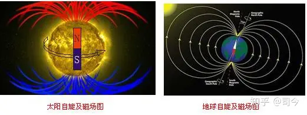

  

  

  

2.4、磁陀螺运动研究中的困难分析

我们教科书对普通陀螺运动研究得较多，较深入，但关于磁陀螺运动的研究却几乎是空白，而且，磁陀螺运动要比普通陀螺运动复杂得多，特别是它在不同磁场中的运动情况。

目前，磁陀螺运动研究的主要困难在于：

（1）、磁陀螺实验与研究的重点是在无重力场影响下进行为佳，但现在无法在微重力环境下对磁陀螺在磁场中的运动展开实验，这就阻挠了对它运动规律的深入探讨与研究。

（2）、对磁性起源、磁场空间类型、及磁场与磁陀螺之间相互作用的物理机制等认识不足，对场及空间的认识还拘泥在经典力学范畴中不能自拔等。

（3）、现有磁场理论不适于描述磁陀螺在磁场中的运动，具体说就是：现在的磁场理论及其物理模型是以法拉第力线为基础而建立起来的，但法拉第力线只是一种人为“假想”线，它实际并不存在，用这种假想线模型来处理“宏观”磁陀螺在磁场中的运动显然是不合适的，为此，就必须对现有的磁场理论进行修订，以便找到一个更适合于磁陀螺运动描述的磁场模型和理论——详细论述请参阅《重论法拉第力线》一节。

**3、建立理论**

通过实验观察与对比分析，我们可以得出磁陀螺在磁场中运动主要受以下几个因素影响：（1）、磁场剪切力（2）、磁场磁极矩力（3）、磁场梯度力。

（1）、磁场剪切力就是我们教科书常说的切割磁力线力，是平动磁陀螺轴二端受二个磁场磁极吸引影响而使其平动速度方向发生改变所表现的力；这种力会使自旋磁陀螺产生曲线运动；其实，从自旋陀螺运动观点来看，磁场切割力是不存在的，它只是磁极矩力的另一种表现形式。

  

  

  

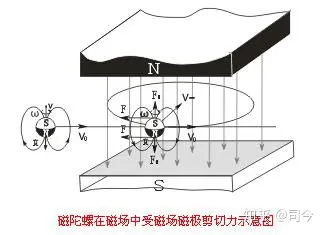

  

（2）、磁场磁极矩力就是磁体磁极对自旋磁陀螺磁极所产生的磁力，它包括二种形式：①.自旋磁陀螺轴与磁极力线平行状态下所产生的磁极力；②.自旋磁陀螺轴与磁极力线不平行状态下所产生的磁极矩力。

  

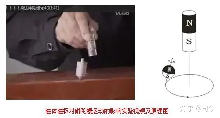

  

（3）、磁场梯度力就是磁陀螺在磁场空间所受的磁场磁极力不相等时，就会产生向磁场磁极移动所表现出的力，如下图，在磁场空间的0、1、2平面内分别放置小磁针，则磁针0会悬浮在B0平面（等磁极力面）上不动，但磁针1、2则会向磁极产生运动。

  

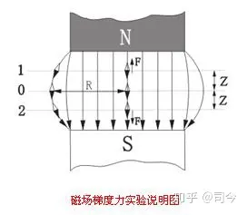

  

但对于平动自旋磁陀螺而言，这种运动就不同于无自旋的小磁针运动了，如下图所示，它会产生螺旋下落运动。

  

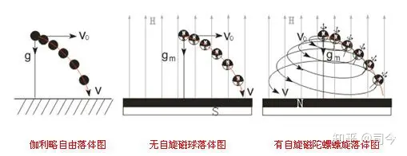

  

磁陀螺在磁场中的受力形式并不是孤立的，而是交织存在，在陀螺磁场对磁陀螺运动影响问题上，就要视那个影响因素占主导地位而定。

**4、验证修订**

验证通常是改变原用于得出理论的那个实验的磁场形态，重新设计实验，对已得结论加以验证。

验证步骤是，先确定磁体磁极形状和磁场空间分布形态，再预测磁陀螺通过此磁场空间会产生怎样的运动；然后做实验，如实验结果与预测一致，说明上述预测正确，否则，须对上述理论或结论加以修订。

如，磁陀螺在均匀磁场的等磁极力面B0中会做洛伦兹运动，假如不在B0平面，则会做“洛伦兹+磁场梯度力”运动，为此，我们设计如下图实验给予验证，验证结果与预测一致，说明我们得出的磁陀螺在磁场中运动的受力规律是对的。

  

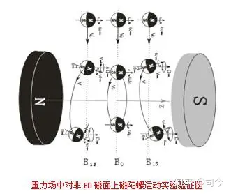

  

同样的，在费曼《物理学讲义》第2卷第29章第6节《加速器中的导向场》（P339）中，对电子在磁场非B0磁面中的运动也有一定讨论，且这个讨论结果与我们上述实验验证结果几乎是一致的,即在非B0磁面上，加速器中的电子可产生垂直向上或向下的“聚焦”运动，这也证明了电子确实像一个自旋磁陀螺。

  

  

**5、** **推广应用**

研究磁陀螺运动的最终目的是要给现代物理磁学找出一个清晰的、统一的物理模型，然后加以推广应用，这种应用领域包括宏观星体和微观粒子二个方面。

我们知道，太阳、行星、原子核，电子等都是自旋体，且都有磁场存在，如果将它们看做是一个个自旋磁陀螺，那么，它们绕中心体磁场的运动原理就应与磁陀螺绕中心磁体的运动原理基本相同；同样的，在均匀磁场空间的磁陀螺运动原理也应适于解释电子的“洛伦兹运动”。

在宏观方面，如，本漫谈所介绍与研究的“杨燕实验”，如果在微重力环境下，磁陀螺绕中心磁体的运动就与带有磁场的自旋地球绕太阳磁场运动的情形几乎相同，这就可以把微重力环境下的“杨燕实验”所得的磁陀螺运动原理应用到对地球绕太阳运动的解释上，同时还能解释地球自旋轴倾斜等问题。

  

  

  

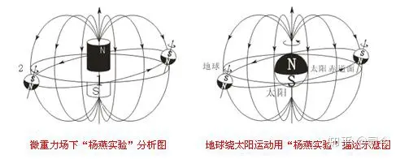

  

在微观方面，如，本漫谈所介绍与研究的“磁极矩实验”，就可用于解决“法拉第电磁感应”形成的物理机制问题等。

  

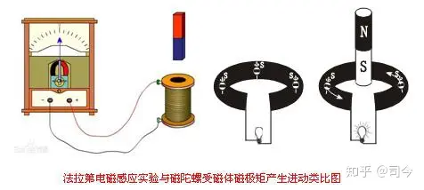

  

磁陀螺运动研究与应用的重要性关键是要与“物体自旋可以产生自旋磁场”这一结论相衔接，如果这一结论正确，那么，自旋的太阳、地球、电子、光子等都可以看做是一个带有自旋磁场的磁陀螺体，只要我们能够对磁陀螺运动作深入了解与研究，然后将得出的规律或结论运用到太阳、地球、电子、光子等包含有自旋的物理运动现象中去，那么，这些运动现象所蕴藏的物理本质问题就可以迎刃而解了。同时，我们也可以利用星体、电子、光子等的一些运动现象来反推磁陀螺运动的一些规律——可以这么说，在研究磁陀螺在磁场中运动方面，微观世界粒子领域已走在了前头。

同时，卢瑟福用“太阳系模型”来推理“原子系模型”的思维方式也给我们带来启迪：寻找大自然现象中的“类比”，可以极大丰富磁陀螺运动研究的内涵和应用范围；

物理学研究既可以“以大看小”，也可以“以小看大”；今天，我们为什么不可以用已建立和掌握的一些粒子运动规律来反哺宇宙星体运动的研究呢？

【参考文献】略

**【注】：**

1、关于几个实验视频地址：

王亚平“太空陀螺运动实验”视频：[http://blog.sina.com.cn/s/blog\_d288bb3b01019ot9.html](https://link.zhihu.com/?target=http%3A//blog.sina.com.cn/s/blog_d288bb3b01019ot9.html)

梁发库老师所做“磁极对磁陀螺运动影响实验”视频：[http://blog.sina.com.cn/s/blog\_d288bb3b0101fu61.html](https://link.zhihu.com/?target=http%3A//blog.sina.com.cn/s/blog_d288bb3b0101fu61.html)

梁发库老师所做“杨燕实验”视频：[http://blog.sina.com.cn/s/blog\_d288bb3b0101fu61.html](https://link.zhihu.com/?target=http%3A//blog.sina.com.cn/s/blog_d288bb3b0101fu61.html)

2、本文所用图片除作特别说明和自我绘制外，均来自「百度图片」，在此对「百度」网表示感谢！

3、特别声明：如其他媒体、网站或个人从本博转载此文，须保留本博“地址”，否则视为侵权行为。

本文引用地址： [http://blog.sina.com.cn/s/blog\_d288bb3b0102vi8n.html](https://link.zhihu.com/?target=http%3A//blog.sina.com.cn/s/blog_d288bb3b0102vi8n.html) 此文来自新浪“陀螺——上帝掷出的骰子”博客，转载请注明出处。
