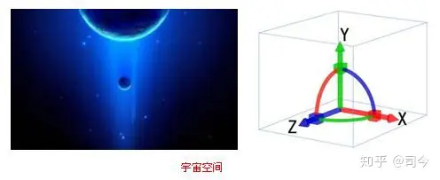
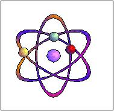
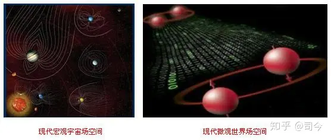
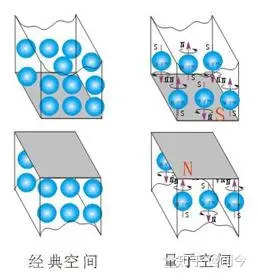
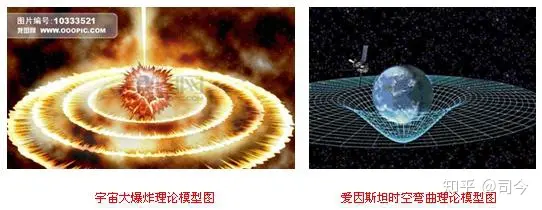
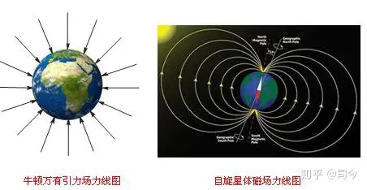
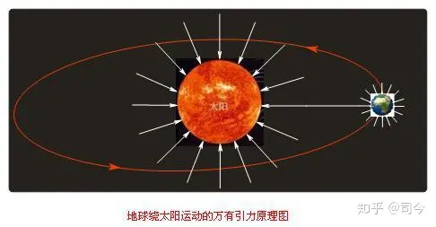
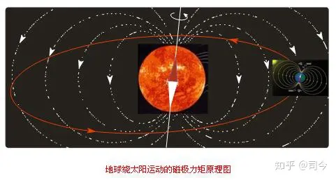

---

date: 2024-05-12 21:45:23

categories: one

tags: 
- 无

original_url: https://zhuanlan.zhihu.com/p/71789858

---

# 4说说现代物理学的空间与运动 

**司** **今**（jiewaimuyu@126.com）

物理学主要研究的是物质基本组成结构及其在时空中运动的学科，物理学研究范围大至宇宙、小至基本粒子等一切物质最基本的运动形式和规律，因此成为其他各自然科学学科的研究基础；更广义地说，物理学是对于大自然的研究分析，目的是为了明白宇宙的行为。

物理学研究的内容是由物质、空间与运动（时间）等要素组成，通过这些要素分析、组合，寻找它们各自属性及其彼此间相互作用的规律是物理学研究的主要目标。

**1、物质**

物质是构成宇宙间一切有形实物和无形客观存在（场）的统称；物质的种类虽多但却有共性，即它们都是客观存在、并能够被观测以或都具有质量和能量等特性。

运动是物质的根本属性，时间和空间则是运动着的物质存在形式。

物质通常是有结构的，物质的本源是单位空间的运动，也可以说是一种量子运动，但物质结构在层次上是否具有基本单元？这是一个长期反复争论而又常新的课题。当代几种不同的量子引力理论尽管对某些问题存在着不同见解，但关于这个问题，从实质上来看却给出了一致肯定的回答。

**2、** **空间**

空间是与时间相对的一种物质客观 存在形式，由长度、宽度、高度、大小表现出来，通常指四方（方向）上下。

  

  

物理学上的空间解释是：惯性参考系与空间是静止的，无论参考系如何运动，包括变速，都不会改变惯性参考系与空间的静止状态；或说惯性参考系与空间是一起运动。

从运动学观点上看，空间又可分为绝对空间和相对空间二种；绝对空间是自身特性与一切外在事物无关，处处均匀，永不移动；相对空间是一些可以在绝对空间中运动的结构，或是对绝对空间的量度，我们通过它与物体的相对位置感知它，它一般被当做不可移动空间，如地表以下、大气中或天空中的空间，都是以其与地球的相互关系确定的。绝对空间与相对空间在形状大小上相同，但在数值上并不总是相同。

  

  

“数学上，空间是指一种具有特殊性质及一些额外结构的集合，但不存在单称为‘空间’的数学对象。在初等数学或中学数学中，空间通常指三维空间”。

  

宏观动态空间

当我们用数学工具来解决物理学空间问题时，空间也就只能是三维的，不可能是n维；如果硬要定义成n维，那么，它在物理定量计算中最终还是要还原成三维，因此说，n维概念只是一种增加物理参数的“兜圈游戏”，并不是解决物理学本质的做法。

  

微观动态空间

**3、运动**

运动是指物布时空永不均产生了普遍运动，普遍运动又使万事万物生灭着；运动与物质密不可分，宇宙中“没有物质的运动”和“没有运动的物质”都是不存在的。

运动具有守恒性，即运动既不能被创造又不能被消灭，其具体形式则是多样的，且能互相转化，但在转化中的运动总量不变。

  

布朗运动动态图

运动可分为宏观运动和微观运动。宏观运动是我们能够看到的普遍运动形式，如宇宙星体运动、牛顿力学中的机械运动等；微观运动是我们用肉眼看不见的的运动，如分子热运动、电子绕原子核运动等。

  

电子绕核运动动态图

运动的基本形式包括平动和自旋二种，我们平时所说的运动一般指的是平动或转动；自旋与平动都是物质在空间中存在的基本形式。

转动是指物体以一点为中心或以一直线为轴作圆周运动，自旋是转动的一种特殊形式。

  

球体滚动动态图

经典刚体力学所讲的平面平行运动就是“平动+自旋”的运动形式，宏观星体、微观粒子运动就表现为这种形式.

  

刚体平面平行运动图

**4、经典物理学与现代物理学**

4.1**、经典物理学**

经典物理学是以经典力学、经典电磁场理论和经典统计力学为三大支柱而构成的庞大物理学体系。

由伽利略(1564—1642)和牛顿(1642—1727)等人于17世纪创立的经典物理学，经过18世纪在各个基础部门的拓展，到19世纪得到了全面、系统和迅速的发展，达到了它辉煌的顶峰；到19世纪末，已建成了一个包括力、热、声、光、电诸学科在内的、宏伟完整的理论体系。特别是它的三大支柱——经典力学、经典电动力学、经典热力学和统计力学——已臻于成熟和完善，不仅在理论表述和结构上已十分严谨和完美，而且它们所蕴涵的十分明晰和深刻的物理学基本观念，对后来人类的科学认识也产生了深远影响，也是现代物理学建立的基础核心。

**4.2、现代物理学**

现代物理学是相对经典力学而言的，随着科技的进步，人们对物质属性及其运动空间产生了有别于牛顿力学与经典电磁学的认识；在宏观方面，如，现代天文学观察结果显示：行星、恒星都有自旋和磁场存在，宇宙空间弥漫着星际磁场等，这些都是牛顿力学所没有的物质、空间属性；在微观方面，人们对物质组成结构及其对粒子属性、粒子运动空间的认识也与经典电磁学有天壤之别，如，粒子都有自旋、自旋磁矩存在、粒子运动空间也都有磁场存在等，这些都是经典电磁学所没有触及的领域。

20世纪诞生的相对论和量子力学是现代物理学与经典力学分道扬镳的标志，也是现代物理学组成的两大最基本支柱。

  

  

**5、现代物理学与经典物理学在物质、空间、运动上的差异**

**5.1、微观领域：粒子属性、空间、运动的差异**

在17世纪到18世纪末，由于人类研究物质的工具手段落后，对微小物质的物理特性也就不能够进行细致、全面地观察与深入研究，故对微观粒子的认识只能局限在“经典力学”范畴内，认为粒子运动应遵循经典力学理论，这就是经典粒子概念的内涵。

但到了20世纪后，随着科技水平的发展，人类能够在纳米级水平上做实验，研究原子、电子等更微小粒子的属性及其运动，这时我们就发现，微观量子粒子的属性与运动和经典粒子的属性与运动存在很大差异，具体表现在：

**5.1.1.粒子属性差异**

经典粒子：只有平动，没有自旋，也没有自旋磁矩存在，它们的运动完全遵循经典物理学的运动规律；

量子粒子：有自旋、平动，且有自旋磁矩存在，它们的运动往往不符合经典物理学的运动规律。

  

  

**5.1.2.空间属性差异**

在经典物理学中， 经典粒子通过的小孔或窄缝，空间范围较大，没有磁场存在；

在现代物理学中，量子粒子通过的小孔或窄缝，空间范围较小，且有一定的磁场存在。

  

  

**5.1.3、运动状态差异**

从经典粒子角度看，粒子通过经典的小孔或窄缝空间时，会表现出直线运动性；

从量子粒子角度看，粒子通过带有磁场的小孔或窄缝空间时，会表现出曲线运动性。

  

  

量子力学虽然认识到经典粒子与量子粒子的属性存在差异，但它没有意识到空间属性也存在差异，从而造成其运动状态出现不同；也就是说，量子力学仍把小孔或窄缝看作是没有磁场存在的“经典小孔或窄缝”，这样，当带有自旋、自旋磁矩的粒子通过“经典小孔或窄缝”时就不会对粒子运动产生磁场影响，即微观量子粒子通过“经典小孔或窄缝”与经典粒子通过小孔或窄缝的运动处境完全一样，这其实就与把微观量子粒子与经典粒子“等同”了的做法。

  

  

用“经典粒子”概念去看待“微观量子粒子”通过“带有磁场的小孔或窄缝”，或用“经典小孔或窄缝”概念去解读“带有自旋、自旋磁矩的量子粒子”通过其空间的运动现象，都必然会得出“波粒二象性”结论来。

可见，量子力学得出“波粒二象性”认识的本质是没有摆脱牛顿经典粒子或经典小孔空间概念的影响，其描述的物理过程就是给经典粒子概念装一个自旋和自旋磁矩的外套，配备一驾“机械波”马车，让它穿过经典小孔或窄缝，这里关键是忘了非经典的小孔或窄缝空间也具有磁场性。

光的“波粒二象性”理论得出用的就是“量子粒子+经典空间”模型；如果改用“量子粒子+量子空间”模型，我们就可以看出光“波粒二象性”的本质是光量子通过带有磁场的小孔或窄缝空间时，会产生“光子洛伦兹运动+磁场梯度力运动”，进而产生所谓的“干涉或衍射”等现象（具体论述请参阅司今《波粒二象性的本质》一文）。

**5.2、宏观方面：星体属性、空间、运动的差异**

宏观星体运动是天文学的分支学科—天体力学研究的范畴，从它的发展史和现代理论水平上来看，自十七世纪开普勒、牛顿等建立起经典的研究理论之后，其并没有出现太大的发展；虽然后人将爱因斯坦的广义相对论运用到其研究中去，但取得的效果并不尽人意，造成这一局面的原因是，我们研究星体运动时还拘泥在开普勒、牛顿时代对星体属性、空间、运动的认识上，没有突破。

虽然我们现在已有太空卫星、大型高科技望远镜等先进观察、测量工具，也对宇宙星体的属性有了更深刻认识，但我们的进步仅表现在“观测”成果上，并没有将这些“观测成果”运用到理论创新与研究中去，致使关于星体运动理论方面未能产生根本性的突破。

相反，时空弯曲、大爆炸理论等已将天体力学的研究方向引向“歧途”，因为这些理论不再是从天体运动的物理机制出发，仅以“感官”、“空想”、“假设”等思维来“撰写”所谓的“星体运动物理规律”。

  

  

现代观察结果显示，不论星系、恒星、行星等，从广义的系统论而言，它们都是一个自旋体，都有自身的磁场存在，它们都在弥漫整个宇宙空间的星际磁场中公转着……看到这些观察结果，我就有点纳闷：我们的天体力学为什么不从自旋、磁场、公转等宇宙星体这些根本属性入手去研究星体运动形成的物理机制和规律呢？

  

  

相比于牛顿时代，我们现在还是沿用万有引力场的观点去看待星体运动，从没有将星体自旋和偶极磁子性纳入其运动规律的探索中。

  

  

如，现代观测已证明，地球是个偶极磁子，太阳也有自己的磁场，那么，我们在研究地球绕太阳作椭圆运动时，为什么不审视一下太阳磁场对地球磁场所产生的真正影响作用在哪里？一味地宣扬太阳风会扭曲地球磁场、太阳表明磁场紊乱等这些“观测+想象”，并不能为探究太阳系行星运动形成的真正物理机制找到答案。

  

  

据我观查与研究，太阳磁场对地球磁场的真正影响在地球磁极上，正是太阳磁极与地球磁极的相互作用才使地球产生绕太阳倾斜的运动——具体分析请参阅以后相关章节。

下面绘制万有引力与磁极矩力观点对“地太系”形成的物理机制描述图做一比较，从这二幅“原理”图中不难发现，万有引力是一种静态模型，它不能真实反映“地太系”运动的情况，用它来解释地球绕太阳运动未免有点“机械”和“落伍”；

  

  

相反，磁极矩力模型是一种动态模型，它能真实反映“地太系”运动的情况，用它来解释地球绕太阳运动就显得比较“灵活”和“现实”。

  

  

同样地，我们也可以从“小太阳系”——木星或土星的磁场对其卫星运动的影响中看出一些倪端来——主星磁场不但会对行星磁极产生极光影响，而且还控制着行星轨道范围和自旋轴倾角大小。

  

  

主星磁极对行星磁极的影响与以后将要介绍的“杨燕磁陀螺实验”原理基本相同，这就为我们从新的角度研究行星运动开创了一条希望之路，也为量子力学从微观走向宏观开启了一扇光明之门。

宇宙是个统一的大磁场，不论星系、恒星、行星等，它们都在自旋着，都有自己的自旋磁场存在，宇宙空间到处弥漫着这些磁场，宇宙万物就在这些磁的海洋中运动变化着——这就是我们神奇宇宙的本来面目！

## **【附录】**

【导言】：现代，随着新观测结果的不断涌现及现有理论的重重困境，人们也开始关注“宇宙磁现象”和“宇宙磁场”问题了，最显著的例子就是「百度百科」词条中就有这方面的论述。

**一、宇宙磁场**

根据宇宙天体的电子运行方式可以产生磁极的定位，如果宇宙中没有磁极的分化存在，就不可能会有星系的形成，因此宇宙磁场作为宇宙秩序的主宰者一定广泛存在于宇宙当中的任何角落。

**1、概述**

比方银河系如果没有磁极做为控制就不可能形成统一盘状星系，那样他就是无规则，没有固定运行方式的“自由星体”，或者根本就无法形成星体，更无法形成星系。

**2、定义**

指地球以外的各种星体和星体之间的星际空间的磁现象。“万有引力”（地心引力）、磁场力、太阳光线等是“原子”微观空间中的何种物质都有磁场,宇宙是个大磁体，在周围空间存在着磁场，即宇宙磁场。

[http://baike.baidu.com/link?url=NRe8roptCX5UHMIUiMNKvajTdy3NRJhOjwDKqfWfnLC17iiFRrBUaLGKJQpQLhpWf0tL2obxP2Y9RRcQnsaSHq](https://link.zhihu.com/?target=http%3A//baike.baidu.com/link%3Furl%3DNRe8roptCX5UHMIUiMNKvajTdy3NRJhOjwDKqfWfnLC17iiFRrBUaLGKJQpQLhpWf0tL2obxP2Y9RRcQnsaSHq)

**二、宇宙磁现象**

宇宙磁现象是指地球以外的各种星体和星体之间的星际空间的磁现象。宇宙磁现象所涉及的空间范围和时间尺度都远超过地球。因此在这里只能选取其中一部分大家可能更为关心和更感兴趣的宇宙磁现象，如阿尔法(α)磁谱仪上天（空间）探测、“阿波罗”飞船登月测月磁、太阳磁活动与太空气象学、脉冲星与超强磁场。\[1\]

**1、太阳黑子**

太阳黑子是在太阳表面出现的很小的较暗的区域。观测表明黑子出现的数目、大小和位置都是随时间变化的。进一步研究表明，太阳黑子是一种太阳磁场引起的局部区域温度降低、发光减弱的现象。太阳黑子也是很早就有了观察记载，但直到近代通过观测和研究才认识到太阳黑子的出现和变化是同太阳的磁场活动密切相关的。太阳的黑子活动不但同太阳的结构和活动等密切相关，而且对于我们地球也有影响。所以太阳黑子的观察研究受到重视。图1是中国北京天文台建造的太阳磁场望远镜，其建造规模和观测研究都居于世界前列。\[2\]

可以从太阳光观测出来的。光的传播速度是远高于高能带电粒子的运动速度的，因此只要观测到太阳黑子和太阳耀斑等剧烈活动的光信号，便可以预测和预报剧烈太阳风的时间。这样就可以对行星际空间将要发生的剧烈太阳风进行预测和预报了。当然这就需要更多和更深入地研究各种太阳磁活动、特别是剧烈太阳磁活动的产生机制和各种影响因素。\[3\]

**1.1、空间时代**

现代人类已进入空间时代，空间环境对人和生物等的影响已受到特别的关注，其中的空间气候如太阳风等便同太阳磁场和太阳系磁场有关密切的关系。\[3\]

**1.2、太阳风**

太阳风是由太阳上的能量高的带电粒子如电子、质子等从太阳表面喷射到太阳外的太阳系空间甚至更远的空间。由于太阳风中粒子带有电荷，因此也将太阳磁场带入太阳系空间甚至更远的空间，形成太阳系行星空间的行星际磁场。图4中便是太阳系行星际磁场的方向。因为太阳风含有高能量带电粒子，这对于行星际中的空间飞行器，特别是对飞行器的人和生物等是有伤害的。因此对剧烈的太阳风的预报和预防是特别需要的。\[3\]

**1.3、预报**

如何预报剧烈的太阳风，因为太阳风是从太阳发射出来的带太阳磁场的高能量带电粒子，是太阳的磁活动，如太阳黑子和太阳耀斑等产生的。这就需要预报太阳的剧烈磁活动。

**2、磁场现象**

**2.1、地球磁场**

在太阳系行星系统中，许多行星的磁场都低于地球的磁场，但是太阳系中最大的行星木星的表面磁场却约为地球磁场的10倍。这是什么原因？进一步深入研究认识到，木星主要是由氢构成的，木星表面为氢气，木星内部压力增大，氢气转变为液态氢，再深入木星内部，压力更增大，液态氢又转变为固态氢。更深入木星内部后固态氢密度更增大，又从绝缘状态的氢转变为金属状态的氢。从物理学理论研究可知，金属氢还可能在一定条件下转变为超导体。如果木星内部存在电阻为零的超导氢，就会存在巨大的电流，并由此产生高的磁场。这样就可以说明木星为什么有较高的磁场。物理学理论研究还指出，金属氢还可能是一种高温高能燃料。这样就促进了关于金属氢的探索性研究。

**2.2、超强磁场与脉冲星**

磁场既然是普遍存在的，那么宇宙中存在着多高的强磁场和多弱的弱磁场？它们又存在于何处？通过大量的天文观测和研究，现在认识到的最强磁场存在于脉冲星中。脉冲星又称中子星，是恒星演化到晚期的一类星体。根据天体演化过程，一般恒星演化到晚期时，由于原子核聚变产生高热能所需的核聚变物质已经用尽，热能剧减，恒星物质的引力便使星体收缩，体积变小，而恒星磁场便因恒星收缩和磁通密度变大而增强。这样，演化到晚期的恒星磁场便急剧大增。例如，演化到晚期的白矮星的磁场剧增到约103~104特\[斯拉\](T），而演化到晚期的脉冲星(中子星）的磁场更剧增到约108~109特\[斯拉\]，分别比太阳磁场增加约千万到亿倍（107~108倍）和约万亿到10万亿倍（1012~1013倍）。例如图5便是在地球高空观测到的武仙星座X-1脉冲星（中子星）发射的X射线谱。进一步研究认识到这一发射的X射线谱是由于X-1脉冲星的电子流在磁场中的回旋运动产生的，而谱线的吸收峰便是电子流在磁场中的回旋共振峰。由回旋共振的位置（X射线的能量）便可计算出回旋共振的磁场的强度约5×108T。这样强的磁场是当今科学技术在地球上远远达不到的，科学技术在地球上所能得到的磁场的强度仅约102T，两者相差约百万倍（106倍）。

根据对各处宇宙磁场的观测，各种星体的磁场都高于星体之间的星际空间的磁场。例如，在太阳系中各行星之间的行星际磁场约为1×10-9~5×10-9特\[斯拉\](T），即约为地球磁场的十万分之一（10-5）。在各个恒星之间的恒星际空间的恒星际磁场，常简称星际磁场，比行星际磁场更低，大约为5×10-10~10×10-10特\[斯拉\](T），即约为行星际磁场十分之一（10-1），也就是约为地球磁场的百万分之一（10-6）。恒星际（空间）磁场是如何知道的，主要是应用恒星光的偏振观测和恒星射电（无线电波）的塞曼效应（即无线电波在磁场中分裂而改变频率）观测及维持银河星系结构的稳定性理论计算等来测定或估算恒星际磁场。由现代多方面的天文观测知道，由大量的恒星形成星系，例如太阳便是银河星系中的一个恒星，而银河星系以外的宇宙空间中还有更多更多的星系。星系与星系之间的空间称为星系际空间，根据多方面的天文观测的间接推算和理论估计，星系际空间的磁场约为10-13~10-12特\[斯拉\](T），即约为行星际磁场的万分之一到千分之一（10-3~10-2）。恒星际磁场大约相当于人的心（脏）磁场（约百亿分之一T），而星系际磁场大约相当于人的脑（部）磁场（约万亿分之一T），甚至低于脑（部）磁场。\[4\]

从上面宇宙磁现象的介绍可以看出，宇宙磁现象是宇宙空间到处都存在的，而且许多宇宙磁现象还同科学研究和我们生活有着密切的关系，还有着远比我们在地球上接触到的磁场更强和更弱的磁场。

**3、研究工具**

阿尔法(α)磁谱仪是1998年人类送入宇宙空间的第一个大型磁谱仪。它利用强磁场和精密探测器来探测宇宙空间的反物质和暗物质，探索和研究宇宙物理学、基本粒子物理学和宇宙演化学的一些重大和疑难问题，例如寻找磁单极子等。最早的阿尔发磁谱仪是1998年由“发现号”航天飞机载入太空，进行了约10天的试验性探测。图2是这次所用的阿尔法磁谱仪中由中国科学家设计制造的关键部件永磁体系统，左下图是在“和平号”空间站上拍摄的在“发现号”航天飞机上的阿尔法磁谱仪。计划在2003年将阿尔法磁谱仪送到国际空间站工作3~5年，进行较长时期对空间反物质和暗物质等的探测。阿尔法磁谱仪(英文缩写为AMS)的研制工作是由美籍华裔物理学家、1976年度诺贝尔物理学奖获得者丁肇中教授提出并领导的一个大型的国际合作科学研究项目，由美国和中国等10多个国家和地区的37个科研机构参加科研工作。其主要目的是寻找太空中的反物质和暗物质，以及解决其他一些重大科学问题。反物质是指由质量相同但电荷符号相反的反电子(即正电子)、反质子和反中子组成的反原子构成的物质，如反氦和反碳等。暗物质是指不能用光学方法探测到的物质。根据现代科学研究中的一些学说，宇宙中除一般见到的物质(即正物质)以外，应还存在反物质；除用光学方法探测到的一般物质以外，应还存在用光学方法探测不到的暗物质。这些物质在磁场中运动时会表现出不同的特点，因而可以用探测器探测出来。阿尔法磁谱仪主要由磁系统和灵敏探测器等构成。\[5\]

[http://baike.baidu.com/link?url=kSnsT0MwIc\_53e4b4ih0b-SsWArsl\_EIWg683ji6LtQsnSYlstde\_iLR43RvLlHP](https://link.zhihu.com/?target=http%3A//baike.baidu.com/link%3Furl%3DkSnsT0MwIc_53e4b4ih0b-SsWArsl_EIWg683ji6LtQsnSYlstde_iLR43RvLlHP)

本文引用地址： [http://blog.sina.com.cn/s/blog\_d288bb3b0102vj0a.html](https://link.zhihu.com/?target=http%3A//blog.sina.com.cn/s/blog_d288bb3b0102vj0a.html) 此文来自新浪“陀螺——上帝掷出的骰子”博客，转载请注明出处。

【参考文献】略

**【注】：**

1、本文所用图片除作特别说明和自我绘制外，均来自「百度图片」，在此对「百度」网表示感谢！

2、特别声明：如其他媒体、网站或个人从本博转载此文，须保留本博“地址”，否则视为侵权行为。

**上期目录：磁陀螺运动与现代物理学漫谈（3）——说说磁性起源**

**下期预告：磁陀螺运动与现代物理学漫谈（5）——说说现代磁学研究中的物理模型及定理**