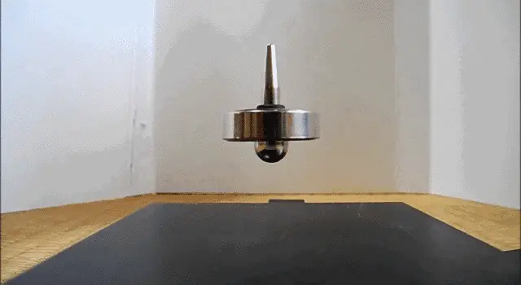
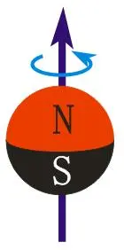
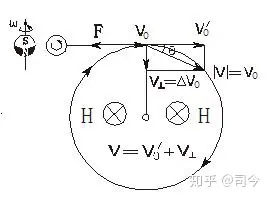
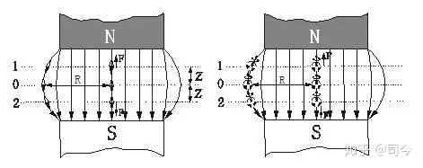
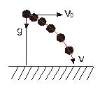
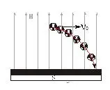
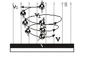
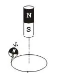
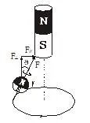

---

date: 2024-05-12 22:01:34

categories: vortex

tags: 
- 无

original_url: https://zhuanlan.zhihu.com/p/75225619

---

# 磁陀螺运动与现代物理学漫谈（9）—磁陀螺在磁场中运动基本原理

## **磁陀螺运动与现代物理学漫谈（9）—磁陀螺在磁场中运动基本原理**

  

**司 今**（jiewaimuyu@126.com）

  

磁悬浮陀螺

磁陀螺是一个自旋磁偶极体，它受磁场磁极作用时不同于没有自旋的小磁针；同时，由于它具有磁偶极性，又不可能用“荷”质点概念（没有空间大小）来描述，对之须辅以轴力矩概念（有空间大小）来描述才行。

  

磁陀螺

磁陀螺与普通陀螺运动最大的不同是它有磁场存在，当它进入磁场空间时会受磁场磁极影响而产生运动变化。

磁陀螺在磁场中运动时，它受力最显著的位置是其自旋轴二端磁极，而不是磁陀螺质心，这一点与陀螺运动表现不同。

  

磁陀螺在中心型磁场中的运动

我通过对磁陀螺在磁场中运动的实验与思考，最终得出磁陀螺在磁场中运动时受磁场影响表现为三种基本作用力形式，即：

（1）、切割磁力线力，（又可称洛伦兹力）就是垂直于磁力线的平动偶磁极陀螺轴二端受磁场磁极引力影响，会使其平动速度方向发生改变所具有的力；这种力会使自旋磁陀螺产生曲线运动；其实，从自旋陀螺运动观点看，切割力是不存在的，它只是磁极力的另一种表现形式。

（2）、磁场梯度力，就是磁陀螺在磁场空间所受的磁场磁极力不相等时，磁陀螺会向磁场磁极产生移动所表现出的力，它与“自由落体运动”形式基本相同。

（3）、磁极力，就是磁场磁极对自旋磁陀螺磁极相互作用所产生的磁力，它包括二种形式：①.自旋磁陀螺轴与磁极磁力线平行状态下所产生的磁极力；②.自旋磁陀螺轴与磁极磁力线不平行状态下所产生的磁极力。

同时，这三种受力又不是孤立的，而是交织存在，从对磁陀螺运动影响上就看那个影响因素占主导地位了。

**1、切割磁力线力**

“剪切”是在一对（1）相距很近、（2）大小相同、（3）指向相反的横向外力（即平行于作用面的力）作用下，材料的横截面沿该外力作用方向发生的相对错动变形现象。能够使材料产生剪切变形的力称为剪切力。

如图-1所示，剪切力大小显然与层间的速度差有关，还与层间相互结合的垂直引力强弱有关。

  

图-1

剪切力产生的条件是：

（1）、二个相距很近的物件平面必须有垂直平面的相互吸引力作用；

（2）、上或下物件之间必须有水平的相对运动趋势，产生水平相对运动的外因可以是水平推、拉力（称为静态剪切力），也可以是上物件以一定的水平运动速度通过静止的下物件平面（称为动态剪切力），这与摩擦力形成的物理机制相通。

磁陀螺在双体偶极磁场空间中的运动是一种动态“剪切”运动，如图-2所示，当自旋磁陀螺以初速度v0进入双体偶极磁场空间时，磁陀螺自旋轴端就会受到磁场磁极力Fz的作用，Fz与v0是垂直的，Fz会阻碍磁陀螺沿v0方向运动，使磁陀螺速度沿v0方向发生改变，其改变大小可以用力来描述，这就是运动磁陀螺在磁场中所受的“剪切力”F，F方向与v0相反，与Fz垂直；如果磁陀螺没有自旋存在，则Fz只会减小它运动速度值大小但不会改变其速度方向；如果磁陀螺有自旋，则Fz不会改变其运动速度值大小，但会改变其运动速度方向——这就会产生曲线运动形式。

  

图-2

对自旋磁陀螺在磁场中运动而言，剪切力**F**永远与其**V**⊥方向垂直，即**F**⊥**V**⊥；如图-3所示，**F**会阻止磁陀螺质心沿初始**V0**方向运动，即磁陀螺在进入磁场的瞬间，其速度变为**V**，但**V0**与**V**值大小不变；从**V0**直线运动方向上看，磁陀螺质心直线运动速度变小了，按牛顿力定义，就相当于在**V0**方向产生了相反的阻力**F**，这个力就称为剪切力或切割磁力线力；同时，**V0**方向速度减小成**V0′**的瞬间，会产生一个与**V0**方向垂直的速度**V**⊥，可称之为洛伦兹速度（**V洛**）；外磁场**H**、剪切力**F**与洛伦兹速度**V洛**符合右手定则。

  

图-3

从磁陀螺意义上来看，洛伦兹力并不存在，它只是自旋磁陀螺在磁场中运动而产生**V**⊥的一种表现形式而已。

磁陀螺轴切割磁力线所带来的运动变化效应，本质就是水平运动对垂直引力的克服作用，这种“剪切力”现象不论在上下型均匀磁场或非均匀磁场空间都存在。

**2、磁场梯度力**

**2.1、均匀磁场的磁场梯度力**

根据库伦磁荷力公式 H=kmqm/z²可知，任何磁场在磁力线方向的不同z空间都存在差值，即为磁场梯度。

如图-4所示，在磁场空间0磁面以上或以下磁场平面都称为非0磁面，在这些平面上，放置小磁针，它们会产生向磁场磁极方向的运动，使小磁针产生这种运动的力，我们就称这种力为磁场梯度力；如果放置的是小自旋磁陀螺，它也会像小磁针那样排列分布。

  

图-4

注：对于自旋的偶极粒子而言，虽它们的半径很小，但它们都有N、S极，磁陀螺N极与磁极磁场**H**N作用， 磁陀螺S极与磁极磁场**H**s作用，从而使该偶极粒子在二个不同强度的磁场空间会表现出向1或2的磁场磁极处运动；因此，从这个意义上来讲，自旋偶极粒子与自旋磁陀螺在磁场中运动的原理应是一致的。

  

图-5

我们以磁极磁场为例：如图-5所示，对一个没有自旋的小磁陀螺而言，如果我们像伽利略研究自由落体运动实验那样作实验，我们就会发现，无自旋的小磁陀螺会在磁场中产生如图-6所示的“磁自由落体运动”；

  

图-6

但对一个有自旋的磁陀螺而言，它就不会只产生“磁自由落体运动”那么简单，它会产生锥螺旋式的曲线落体运动，如图-7所示，这个运动可以看做是自旋磁陀螺的“自由落体运动”与切割磁力线曲线运动的合成运动；

  

图-7

自旋磁陀在锥螺旋上的运动速度**V**就是其在磁场的“磁自由落体运动”**V**⊥ 与其在磁场平面作切割磁力线作曲线运动速度**V**0的合成速度，即**V**⊥+ **V**0=**V**，**V**⊥代表螺距变化， **V**0代表螺旋半径变化，这样它才能合成锥螺旋运动。

**2.2、非均匀磁场中的磁场梯度力**

在施特恩-格拉赫实验中，银原子通过磁场后之所以能够分裂成上下对称的二束沉淀痕迹，如图-8所示。

  

图-8带有磁场梯度的施特恩-格拉赫实验

对此，量子力学的解释是因为银原子带有磁矩，当它们通过非均匀磁场时受到一个磁场梯度力的作用，其大小是：F=μz•dB/dz.

这个磁场梯度力F指的是磁极磁场随垂直距离变化而产生的磁场强度变化所受的力，其本质就是银原子总角动量所表现出的磁量（用pm表示）大小在磁场梯度z方向分量所受磁场梯度影响而产生的力；但量子力学用dB/dz来描述这种磁场梯度变化时，应存在误导性，因为磁场梯度的产生与磁极空间距离有关，这时的磁场概念不是感应磁场B，而是库伦磁荷力磁场H，且H=km.pm/z²，因库伦磁场H是磁场空间磁势变化的负梯度，即H=-△Um/△z(Um表示磁场空间磁势)。

在量子力学梯度力公式F=μz•dB/dz公式中，dB/dz应该是dH/dz.

由此可见，量子力学将用磁通量描述的感应磁场B(B=Φm/S)与用库伦磁荷力描述的库伦磁场H(H=km.pm/z²)看作是同一种磁场了，这种认识在麦克斯韦得出电磁波运动速度是c=3×10^8m/s时也存在，那么感应磁场B与库伦磁场H到底可不可以看作是同种磁场呢？我在以后的文章中会给出详细证明：对磁陀螺在磁场中运动而言，它们就是同一种磁场的二种不同描述形式。

**3、磁极矩**

磁极力就是二个磁体的磁极间相互作用力；对一个自旋磁陀螺而言，当在其自旋轴上方放置磁铁时，它会产生绕磁铁磁极作自旋轴倾斜的圆运动，且圆周运动半径会逐渐缩小，这是因自旋轴受磁铁磁极力矩作用产生倾斜而进动的结果，在此请大家观看梁发库老师所做的磁陀螺运动实验视频（图-9）。

  

图-9梁发库老师视频截图\[1\]

对上述运动现象，我们可以用图-10来描述，即磁陀螺自旋轴倾斜是由于受到磁场磁极力矩作用的结果，磁陀螺作曲线运动是由于磁场磁极使磁陀螺自旋轴产生倾斜后，磁陀螺质心会产生重力矩而作进动的结果，至于为什么会表现出曲线运动而不是进动，我在以后章节中会做详细阐述。

  

图-10

对磁陀螺绕磁极作曲线运动形成的物理机制问题，我们还可以有以下二种解读方式，如图-11所示：

  

图-11

（1）力分解

自旋磁陀螺轴上端受磁场磁极力为F，这个力可以分解为F⊥、F∥二个力分量，且有**F= F⊥+ F∥；F⊥**使磁陀螺产生向上的磁场梯度力作用，**F∥**使磁陀螺产生圆运动的向心力，二种之合成就形成图-10的曲线运动轨迹。

（2）磁矩

**F**∥作用在自旋轴方向的球体半径**r**上，就会对球产生磁力矩**L=r·F∥** ,它会使磁陀螺产生自旋轴倾斜角为θ的进动；磁陀螺进动必须有持续力矩的作用，这里，**F**∥就可以提供这个力矩，并不需要质心重力来提供。

【参考文献】略

**【注】：**

1、梁发库老师所做“磁极对磁陀螺运动影响实验”视频：

[http://blog.sina.com.cn/s/blog\_d288bb3b0101fu61.html](https://link.zhihu.com/?target=http%3A//blog.sina.com.cn/s/blog_d288bb3b0101fu61.html)

2、本文所用图片除作特别说明和自我绘制外，均来自「百度图片」，在此对「百度」网表示感谢！

3、特别声明：如其他媒体、网站或个人从本博转载此文，须保留本博“地址”，否则视为侵权行为。

4、本文较原「新浪博客」文内容有较多修订。

**上期目录：磁陀螺运动与现代物理学漫谈（8）——陀螺运动基本原理简介**

**下期预告：磁陀螺运动与现代物理学漫谈（10）——磁极磁场对磁陀螺运动的影响**