---

date: 2024-05-12 22:21:51

categories: vortex

tags: 
- 无

original_url: https://zhuanlan.zhihu.com/p/76812451

---

# 磁陀螺运动与现代物理学漫谈（13）—非均磁场对磁陀螺运动的影响（1） ——兼谈磁镜效应形成的物理机制 

## **磁陀螺运动与现代物理学漫谈（13）—非均磁场对磁陀螺运动的影响（1）**

——兼谈磁镜效应形成的物理机制

**司** **今**（jiewaimuyu@126.com）

磁镜(Magnetic Mirror) 是一种中间弱、两端强的特殊的非均匀磁场位形，如图-01所示。

  

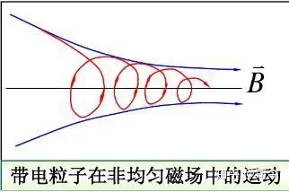

图-01.磁镜装置形成的非均匀磁场

产生这种磁场的制作方法很多，比较简单的是用两个电流方向相同的线圈产生一个中间弱两端强的磁场，这一磁场区域的两端就形成了两个磁镜，这磁场分布叫磁瓶如图-02所示；另一种磁镜由很多匝线圈绕成直线管形状的管室，两端线圈密度比中间大，从而两端磁场比中间强。

  

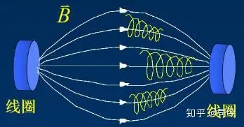

图-02.磁镜装置

磁镜效应是指带电粒子在磁镜装置内运动所产生的一系列的振动变化，如电子、等离子等在磁镜装置所形成的非均匀磁场中运动会受到一定的非均匀磁约束，这种约束的物理原理是：

当绕着磁力线旋进的粒子由弱磁场区进入两端的强磁场区域时，就会受到一反向力的作用，这个力迫使粒子运动速度减慢，轨道螺距缩短，然后停下来并反射回去，反射回去的粒子达管子中心区域后，又向另一端螺旋前进，达端口后又被反射回来。粒子就像光在两个镜子之间来回反射，所以称之为磁镜。

  

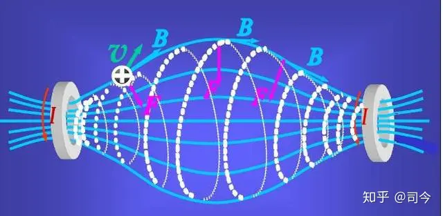

磁镜里的非均匀磁场

磁镜效应的本质体现的是电子、等离子等在非均匀磁场空间中运动受磁场梯度力和洛伦兹力共同作用的结果，对此，我们必须厘清磁镜磁场及电子、等离子等的物理属性，才行真正看清磁镜效应的真正物理含义来。

  

电子像一个小自旋磁陀螺

现代教科书只是笼统地讲磁镜可以对带电粒子进行纵向和横向约束，并没有从粒子自旋磁矩角度入手去探讨磁镜效应产生的物理机制问题；其实电子不但有质量、电荷属性，还有自旋磁矩属性，也就是说，电子可以被看作是一个小自旋磁陀螺，而等离子是指物质原子内电子在高温下脱离原子核吸引，使物质呈正负带电粒子状态存在的形式，那么，从这个意义上来说，等离子也可以看做是带有自旋和自旋磁矩的“小磁陀螺”。

  

原子核也有自旋磁矩

如果我们从自旋磁陀螺在磁场中运动的眼光去审视“磁镜效应”形成的物理机制问题，则就会发现，磁镜效应形成的真正物理机制与自旋磁陀螺在非均匀磁场中运动的物理原理相一致。

本文正是沿着这一思路，尝试性地探讨了带有自旋磁矩粒子在非均匀磁场中是如何产生磁镜效应的？在此也为这种探索思路抛砖引玉，欢迎大家不吝赐教，并给予批评与指正！

  

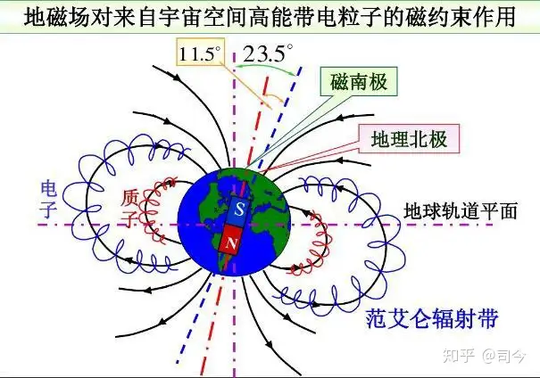

地磁场中的磁约束

▁▁▁▁▁▁▁▁▁▁▁▁▁▁▁▁▁▁▁▁▁▁▁▁▁▁▁▁▁▁▁▁▁▁▁▁▁▁▁▁

我曾做过这样一组磁陀螺运动实验：

图-1所示，让装有非金属轴的自旋磁陀螺从倾斜拱槽中向下滚动，如果自旋磁陀螺是从靠近锥型磁极S极处进入非均匀磁场空间时，则它会产生趋向S极的螺旋曲线运动；如果自旋磁陀螺是从靠近N磁极处进入非均匀磁场空间时，则它会产生趋向N极的螺旋曲线运动,图-2所示。

  

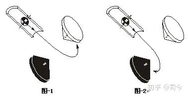

  

当自旋磁陀螺运动速度足够小、外磁场足够大时，它甚至可以出现较明显地趋向磁极的锥螺旋运动。

这组实验表明，自旋磁陀螺平动通过非均匀磁场空间时，其运动轨迹会受磁场磁极影响。

（注：这是在有地球重力场影响下所作的实验，如果将这个实验放到微重力的太空，那将是另一番图景：磁陀螺进入磁场空间时将会产生明显的锥螺旋运动；本节所讨论的磁陀螺运动就是在重力场影响可以忽略的微重力环境下进行分析的。

自旋磁粒子在磁场空间运动也可以看做是不受重力场影响的状况，因粒子重力与其所受磁场力相比太弱了，可以不予考虑）。

**1、磁场磁极力**

磁极力就是一个偶磁体磁极对另一个偶磁体磁极所产生的磁场力；依据空间磁场分布密度可分均匀磁场磁极力和非均匀磁场磁极力。

对于非均匀磁场磁极力而言，依据二个磁体所在空间位置不同可分二大类：

（1）、左右型磁场磁极力（2）、上下型磁场磁极力。

1.1、左右型非均匀磁场磁极力实质是二个左右放置的磁体磁极之间的作用力，它表现的是二体磁力系统，如图-3所示。

  

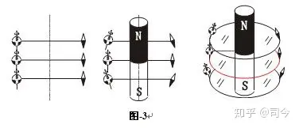

  

1.2、上下型非均匀磁场磁极力实质是在上下放置的二个磁体之间再放置一个偶磁体、这个偶磁体磁极与磁场磁极之间的作用力，它表现的是三体磁力系统；现代物理学研究中常见的上下型非均匀磁场构成形式如图-4所示。

  

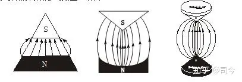

图-4

**2、上下型非均匀磁场磁极力对自旋磁陀螺磁轴的影响**

**2.1、对静态自旋磁陀螺磁轴的影响**

我们以倒三角磁场为例，图-5-1所示，我们先垂直放置二行小磁针，然后将倒三角磁场二极放置在二行小磁针的上下方，可以发现，小磁针的磁极分别有了转动，并指向倒三角磁体的尖端和凹槽磁体的最低端，如果小磁针可以自由移动的话，它们还会出现向磁场磁极最强端移动的情况。

这样，我们就可以用法拉第磁力线概念将倒三角磁场强度分布描绘成如图-5-2所示的形式。

  

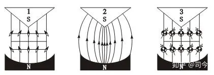

图-5

如果我们用自旋小磁陀螺代替小磁针，同样会发现，自旋小磁陀螺磁极也有了转动，并指向倒三角磁体的尖端和凹槽磁体的最低端，如图-5-3所示；不过自旋小磁陀螺因为有了自旋轴的倾斜变化，它们会产生绕磁场磁极最强端空间进动并移动的情况。

从上述验证实验可以发现：在上下型非均匀磁场中，自旋磁陀螺磁极除受磁场磁极垂直梯度力外，还有一个水平梯度力分量存在，这就使自旋磁陀螺向非均匀磁场磁极最强端产生螺旋运动。

我们以锥磁体磁场为例，用小磁针、小磁陀螺进行实验，就可得出该磁场磁力线分布情况及小磁针、小自旋磁陀螺磁极倾斜及运动状况，如图-6所示。

  

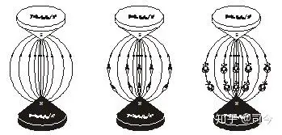

图-6

**2.2 、对平动自旋磁陀螺磁轴的影响**

如果我们让一个平动速度为v的自旋磁陀螺通过非均匀磁场空间，那么这个磁陀螺将会产生怎样运动呢？

我们以图-6锥体磁场为例，先分析一下自旋磁陀螺在磁场空间平动时所受磁场磁极力情况，然后再讨论它们在该磁场中所产生的运动轨迹。

当磁陀螺以v速通过非均匀磁场空间时，其自旋磁轴会受非均匀磁场磁极三个力作用：

（1）、磁陀螺自旋轴切割磁力线所产生的的洛伦兹力

所谓洛伦兹力，实质就是自旋磁陀螺磁轴二端受磁场磁极力（水平剪切力）影响而使之产生运动速度方向变化的表现形式，这个力只改变磁陀螺水平运动的方向，不改变其运动速度大小，如图-7所示。

  

图-7

（2）、磁陀螺自旋轴所受非均匀磁场磁极的水平梯度力

所谓磁场水平梯度力就是非均匀磁场磁极会对磁陀螺水平移动产生影响的表现形式，如图-8所示，由于磁陀螺自旋轴上下端受倒圆锥磁极力影响会产生自旋轴倾斜，如果将这个力放到笛卡尔坐标上，就可分解为垂直和水平二个分量，其中力水平分量就称为水平梯度力，它会使自旋磁陀螺产生绕圆锥尖端磁场最强空间进动，且由此所产生的进动速度与其初始平动速度合成，就会使磁陀螺运动表现出比初始速度稍有增大的现象。

  

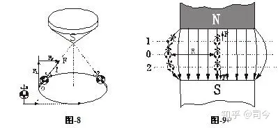

  

（3）、磁陀螺自旋轴所受非均匀磁场磁极的垂直梯度力

所谓磁场梯度力，实质就是自旋磁陀螺磁轴二端受磁场磁极力不均衡影响而产生向某一磁极方向运动的表现形式，如图-9所示；对非均匀磁场而言，就是图-8所示的磁陀螺轴所受磁场磁极力的垂直分量部分。

这方面详述请阅司今《磁陀螺运动与现代物理学漫谈（9）——磁陀螺在磁场中运动的基本原理》一文\[1\]。

**3、自旋磁陀螺在上下型非均匀磁场中的曲线运动**

如图-10-1所示，二个圆锥体磁极组成的磁场空间是一种非均匀磁场空间，让自旋磁陀螺平动进入这个空间后会产生二种运动情况，即“0梯度面”会产上生平面洛伦兹运动，“非0梯度面”上则会产生锥螺旋运动，具体分析如下：

如图-10-2所示，如果磁陀螺以v速从磁场“0梯度面”进入，因其自旋轴二端受磁场磁极的梯度力F=0，故它就只产生切割磁力线的洛伦兹式运动，且其自旋轴也不会发生倾斜。

  

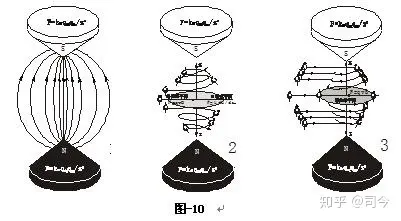

  

如果磁陀螺是从“非0梯度”面进入磁场，则它就会受到非均匀磁场磁极力作用，这个引力可分解为水平和垂直二分量，水平力分量会使其产生绕磁场磁极最强端作平面曲线运动，垂直分量则会使其产生向磁场磁极的垂直移动，这样，磁陀螺会在该磁场中产生锥螺旋运动形式；同时，磁陀螺向磁极移动时，磁场强度会增大，从而使磁陀螺的水平运动速度也表现出增大，且此增大规律遵循角动量守恒原理，即（v+v0）r=k守恒（v0为磁陀螺初速度，v为其进动速度，r为其螺旋运动半径）。

如图-10-3，如果在平行z轴外空间用不同高度的磁陀螺以相同速度射入此磁场，从磁极对磁陀螺轴影响角度来考虑，则越靠近磁极的磁陀螺自旋轴倾角越小，它在磁场中形成的曲线运曲率越大，反之越小。

如果射入的磁陀螺平动速度足够大，则它就会穿过该磁场空间作非闭合锥曲线运动，这可使打在后屏幕上的磁陀螺呈现出如图-11所示的“衍射”现象来，这种衍射机制也可用于解释自旋磁粒子的圆孔衍射现象。

  

  

**4、磁镜效应形成的物理机制**

**4.1、目前教科书对磁镜效应形成的物理机制论述**\[2\]

  

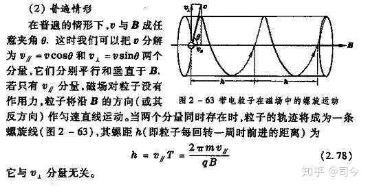

  

  

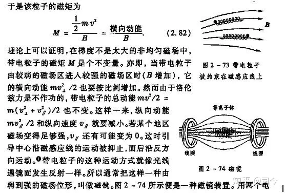

  

  

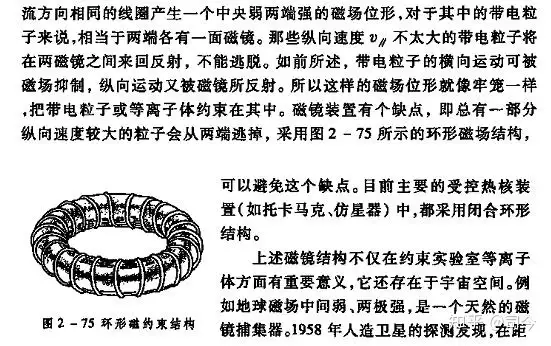

  

  

  

从上述引文中可看，现代物理学将等离子在磁镜非均匀磁场中的运动效应归咎于：在等离子总动能E=mv⊥²/2+ mv∥²/2守恒下，由于磁场梯度力作用而使mv⊥²/2增大，则mv∥²/2就会减小，从而造成其曲线运动半径减小，甚至为0而产生折返运动现象，如图-12所示.

  

  

对此，我的疑问是：

（1）在洛伦兹运动中，带电粒子以初速度进入任何强度的均匀磁场中，其产生的洛伦兹曲线运动速度（指v∥）是不变的，即其值仍为初速度；那么，在非均匀磁场中，其作洛伦兹运动速度为什么会产生变化呢？

（2）我们知道，磁力线是一条人为假设线，它实际并不存在，如果说带电粒子在非均匀磁场中运动的磁矩是不变量，那么描述这个磁矩的中心点是什么？是指那条人为假设的磁力线吗？如果不是，那么它又在绕谁运动而产生所谓的磁矩呢？

（3）我们已给出v⊥与v∥都是个变量，那么，我们所说的带电粒子轨道磁矩（μl=-el/2me）的角动量l该用哪个速度进行定量呢？……

面对这些疑惑，我感觉现代教科书给出的解释不够深入和全面，这种解释思路只局限于经典电磁学范畴，没有真正把握带电粒子具有自旋“磁陀螺”性来处理问题；如果我们将带电粒子看做是自旋小磁陀螺，那么，它在非均匀磁场中的运动规律就可以从宏观磁陀螺的运动来予以验证和描述，这样就会给人以清晰之感了。

**4.2、从磁陀螺运动谈磁镜效应形成的物理机制**

磁镜效应的本质体现的是等离子在非均匀磁场空间中运动受磁场梯度力和洛伦兹力共同作用的结果，对此，我们必须厘清磁镜磁场及等离子的物理属性，才行真正看清磁镜效应的物理含义来。

**4.2.1、磁镜效应中线圈磁场的物理属性**

磁镜效应的非均匀磁场是由二个线圈组成的，如图-13-1所示，在二个线圈间的磁场磁力线分布呈“橄榄”状（我们也可以用小磁针测试予以验证），这种磁场分布就与二个锥形磁极组成的磁场空间磁力线分布相同，如图-13-2所示；这就为我们探究等离子磁镜效应形成的物理机制打开了一扇“宏观”之门，即可以用自旋磁陀螺在该磁场中的运动作比拟。

  

  

**4.2.2、磁镜效应中等离子的物理属性**

气体温度断升高，则构成分子的原子将发生分裂，形成独立的原子，如氮分子会分裂成两个氮原子，我们称这种过程为气体分子的离解；如果再进一步升高温度，原子中的电子就会从原子中剥离出来，成为带正电荷的原子核和带负电荷的电子，这个过程称为原子的电离。当这种电离过程频繁发生，使电子和离子的浓度达到一定数值时，物质的状态也就起了根本变化，它的性质也变得与气体完全不同。为区别于固体、液体和气体这三种状态，我们称物质的这种状态为物质的第四态，又名等离子态，如图-14所示。

等离子态下的物质具有类似于气态的性质，比如良好的流动性和扩散性。但是，由于等离子体的基本组成粒子是离子和电子，因此它也具有许多区别于气态的性质，比如良好的导电性、导热性。等离子体的比热与温度成正比，高温下等离子体的比热往往是气体的数百倍。

等离子状态，是指物质原子内电子在高温下脱离原子核吸引，使物质呈正负带电粒子状态存在的形式\[3\] 。

  

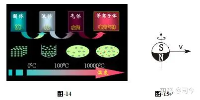

  

从上述描述中可以看出，等离子态只有在高温下才可以形成，高温意味着等离子具有很高的运动速度；同时，等离子态下的粒子（如原子核、电子等）不仅有电荷属性，还有自旋和自旋磁矩性，因此它们就可以被看做是一个自旋微磁陀螺，如图-14所示，它们在非均匀磁场中的运动就像自旋磁陀螺在该磁场中的运动情况一样，会形成锥螺旋运动。

**4.2.3、磁镜效应形成的物理机制**

**4.2.3.1、“非0梯度面”上磁镜效应形成的物理机制（v0⊥B情况）**

我在《磁陀螺运动与现代物理学漫谈（11）——兼谈洛伦兹运动形成的物理机制》\[4\]一文中解析了一个自旋磁电子从均匀磁场的“0梯度面”之上或下空间进入磁场时，由于电子自旋磁轴上下端受磁场N、S极引力不平衡，则越靠近磁场磁极处的磁场强度B会越大，如图-16-1中就有B1＞B0，这时电子自旋磁轴就会受到磁场磁极梯度力作用向磁极移动，且越靠近磁极则电子移动速度就会越快；同时还伴有电子自旋磁轴的倾斜效应。

依据B1＞B0，T=2πm/qB，则有T1＜T0；依据r=mv/qB则r1＜r0.

依据z1＜z0，F梯=km.qm1.qm.2cosθ/z²，（z为电子自旋磁轴上端到磁场磁极的垂直距离，θ为电子自旋磁轴与z线之间的夹角），则有F梯1＞F梯0.

这样自旋磁电子在该磁场中运动就会形成一个锥螺旋轨迹，如图16-2所示。

那么，对于非均匀磁场，当自旋磁电子以平动速度v0垂直于锥体中心线进入磁场时，也会产生螺旋运动轨迹，且也伴有电子自旋磁轴倾斜变化，如图-16-3所示。

  

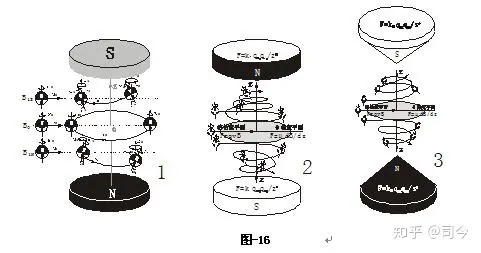

  

但要注意：对于电子自旋磁轴在均匀磁场运动倾斜与其在非均匀磁场中运动倾斜的物理机制是不一样的，且轴倾斜姿态在空间方向上也表现不同，具体论述请参阅司今《磁陀螺运动与现代物理学漫谈（14）—上下型非均匀磁场对磁陀螺运动的影响（2）——兼论施特恩-格拉赫实验形成的物理机制》一文。

上述运动形式对带有自旋磁矩的等离子也一样，当自旋磁等离子以平动速度v0垂直于线圈中心线，从“非0梯度面”进入非均匀磁场空间时，等离子不但会产生螺旋运动轨迹，且也伴有自旋磁轴倾斜变化，如图-17所示。

  

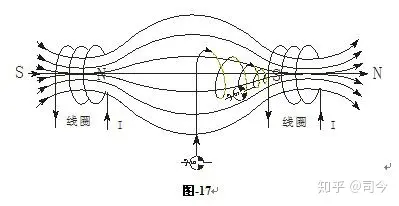

  

**4.2.3.2、任意梯度面上磁镜效应形成的物理机制（v0与B不垂直情况）**

如图-18所示，当自旋磁等离子以v0与B不垂直的状态从在“非0梯度面”进入非均匀磁场空间时，它向磁场磁极运动的螺距速度是由三个分量速度合成的：

（1）、等离子自旋磁轴受磁场梯度力向靠近磁极的速度，其值为：

由F=km.Qm.qm.cosθ/z²=m△vz/t,可得△vz=km.Qm.qm.cosθ.t/mz².

（2）、磁等离子以初速度v0与B不垂直情况运动，则v0在线圈中心线方向就会产生一个速度分量v⊥，其值为v⊥=v0 sinθ.

（3）、等离子自旋磁轴受磁场非均匀磁场磁极力影响而产生自旋轴倾斜，这个力可分解为水平和垂直二个力，其中垂直力会使等离子产生向磁场磁极运动的速度v⊥倾.

那么，等离子向磁场磁极运动的合成螺距就是：L=（△vz+ v⊥+ v⊥倾）t.

等离子在非均匀磁场中运动的螺旋半径R也受二方面影响：

（1）、等离子进入磁场后所产生的洛伦兹力对其螺旋运动半径的影响，其值为

R洛=mv0/qBcosθ，当B随z变小而增大时，R就会变小。

（2）、等离子自旋磁轴倾斜所产生的进动速度对螺旋运动半径的影响，其值为

由F=mv∥²/R=km.Qm.qm.sinθ/z²可得, R倾=mv∥².z²/km.Qm.qm.sinθ，即当等离子越靠近线圈磁场平面时，其z值越小，这时R也就会变得越小。

等离子螺旋运动的合成半径是：R=R洛+R倾.

  

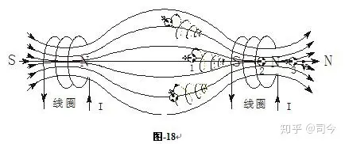

  

通过上述分析可知，线圈磁场对等离子运动的“捆扎效应”是由等离子“磁陀螺”在非均匀磁场中作锥螺旋运动的结果，那么等离子为什么不能从线圈二端逃脱出来呢？

以图-18为例，处于1状态的自旋磁等离子受磁场磁极力作锥螺旋运动到2位置时，等离子自旋磁轴将与线圈内磁力线平行，并在z方向呈加速运动状态；当它沿线圈磁力线运动到3位置时，由于线圈外磁场N极方向与等离子自旋磁轴左端S极方向相异，这时等离子沿磁力线N方向就会做减速、甚至反转运动，还可能在线圈的内外磁场作往复运动，这就是磁等离子不能从线圈二端逃脱出去的原因所在。

**但要注意：**等离子在非均匀磁场中运动是一个变速运动，这种运动与回旋加速器中粒子变速运动有本质区别：前者获得速度变化的原因是等离子自旋磁轴倾斜产生进动而引起的速度变化，它是在外界没有能量输入情况下进行的；后者获得速度变化的原因则是内置交变电场对电性粒子产生加速作用的结果，它是在外界有能量输入情况下产生的——我这里之所以要强调它们速度变化的差异，就是想提醒一些热衷于“自由能”开发的朋友们：

**利用非均匀磁场来改变自旋磁粒子平动速度，让粒子自旋能转换成平动能——这将是开发、利用粒子“自旋能”产生自由能的有效方法之一！**

  

  

  

  

**【特别声明】：**

1、本文所用图片除作特别说明和自我绘制外，均来自「百度图片」，在此对「百度」网表示感谢！

2、如其他媒体、网站或个人从本博转载此文，须保留本博“地址”，否则视为侵权行为。

**【参考文献】**略

**【注】：**

\[1\]、《磁陀螺运动与现代物理学漫谈（9）——磁陀螺在磁场中运动的基本原理》：

[http://blog.sina.com.cn/s/blog\_d288bb3b0102vuaq.html](https://link.zhihu.com/?target=http%3A//blog.sina.com.cn/s/blog_d288bb3b0102vuaq.html)

\[2\]、赵凯华、陈熙谋/《电磁学》，高等教育出版社，2003.4第1版，P128-129、P135-137.

\[3\]、360百科.等离子： [http://baike.so.com/doc/1350221-1427437.html](https://link.zhihu.com/?target=http%3A//baike.so.com/doc/1350221-1427437.html)

\[4\]、《磁陀螺运动与现代物理学漫谈（11）——兼谈洛伦兹运动形成的物理机制》：

[http://blog.sina.com.cn/s/blog\_d288bb3b0102w4fe.html](https://link.zhihu.com/?target=http%3A//blog.sina.com.cn/s/blog_d288bb3b0102w4fe.html)

**上期目录：**磁陀螺运动与现代物理学漫谈（12）——均匀磁场对磁陀螺运动的影响（2）——兼谈粒子衍射形成的物理机制

**下期预告：**磁陀螺运动与现代物理学漫谈（14）—非均磁场对磁陀螺运动的影响（2）——兼论施特恩-格拉赫实验形成的物理机制