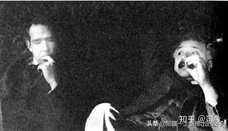
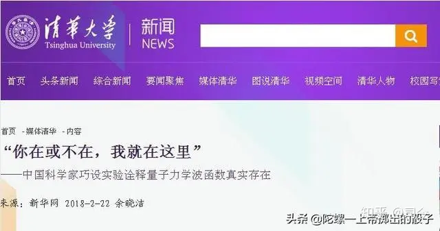
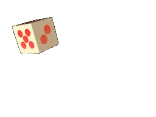
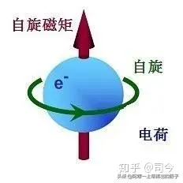
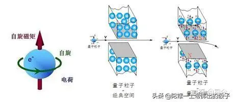
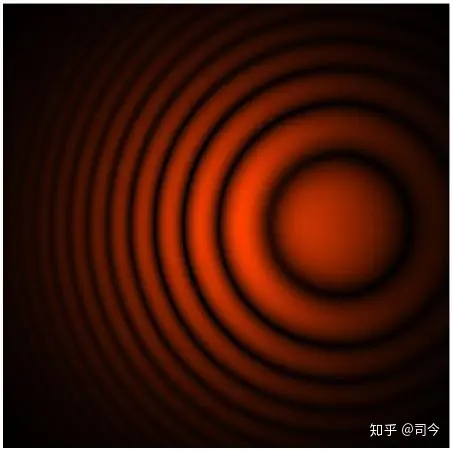
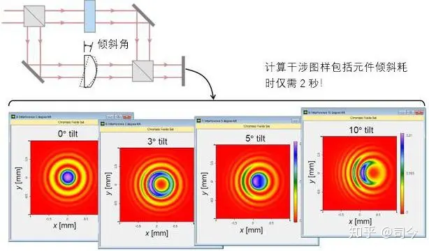
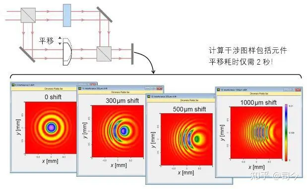
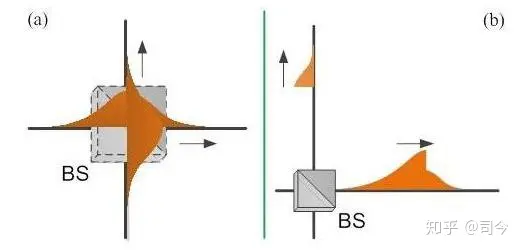

---

date: 2024-05-12 23:31:07

categories: vortex

tags: 
- 无

original_url: https://zhuanlan.zhihu.com/p/67697862

---

# 中国科学家真的揭开了量子力学波函数神秘面纱吗？

——读清华大学新闻网《中国科学家巧设实验诠释量子力学波函数真实存在》一文有感

司 今（jiewaimuyu@126.com）

  

  

薛定谔波函数方程是量子力学建立的支柱，但对波函数方程所表现出的物理意义的认识，在量子力学建立之初就存在巨大争议，而且这种争议到现在还在持续。

爱因斯坦在1926年12月在给玻恩的回信中曾写道：“这个理论解决了很多问题，但是它并没有让我们真正理解旧理论中的秘密......我无论如何也不相信上帝会投骰子。”

  

  

玻恩则认为，量子力学的关键在于概率性和不确定性，就像心率失常的偶然发生一样。

薛定谔本人则倾向于现实地用物质波来解释这些波函数。 但在丹麦物理学家尼尔斯.玻尔和德国物理学家海森堡的推动下物理学界逐渐达成了一个共识：对量子论的诠释不应过于字面化；

  

  

波尔曾说：“没有量子世界。只有抽象的量子理论对世界的描述。物理学的任务并不是去发现自然是什么样的。物理学应该关注的是我们可以就自然说些什么”。

波尔这种说法得到了海森堡回应：“我们必须记住，我们所观察到的不是自然本身，而是暴露在我们的观察方法下的自然。”

他们所坚持的反现实主义'哥本哈根解释' - 否认波函数代表量子系统的真实物理状态很快成为思考量子力学的主要方式。这种反现实主义解释的最新变化表明，波函数只是一种“编码”我们的经验的方式，或者是我们从物理经验中获得的主观信念，使我们能够利用我们过去学到的东西来预测未来。

  

  

爱因斯坦不能接受这种解释，即波函数不是“真实的”。 他无法接受自然法则在原子尺度上如此不和谐，这带来了非决定性和不确定性，事件的结果无法完全和毫不含糊地从原因中预测出来。

......，......

我比较赞同爱因斯坦的观点！

可以这么说，今后，谁能够彻底解决了量子力学波函数真正的物理意义，谁将真正了解并解量子力学，量子力学也将由此获得浴火重生！

  

  

最近，我在清华大学新闻网上读到《“你在或不在，我就在这里”——中国科学家巧设实验诠释量子力学波函数真实存在》一文，对此，颇有困惑！

文中说，“清华大学教授龙桂鲁提出“波函数是微观物体的真实存在”的全新观点，创造性地设计了“相遇延迟选择实验”，并领导团队成功完成实验。”

我认为，这又是一个“新瓶装旧酒”的诠解观点！

我们知道，几率是粒子性的产物，波不可能用几率来描述，站在经典粒子角度看，衍射似乎仅是波动性的专利，经典粒子不可能产生衍射，于是乎，量子力学将粒子的运动定性为波粒二象性。

  

  

现代物理学实验及研究都已进到了亚原子空间，且已证明亚原子粒子已不同于经典粒子了，即它们都有自旋、自旋磁矩性，如果我们用粒子的自旋、自旋磁矩性去重新审视粒子衍射问题，我们就会发现，衍射不是波的专利，带有自旋磁矩的粒子通过磁场空间后也会产生转弯运动。

  

  

再看看量子力学中的支柱性方程——薛定谔方程，它虽是从机械波方程中变换而来的，但由于融入了动能、动量概念，因此，它就不再是真正意义上的波方程了，而是一个描述粒子通过磁场空间运动的实实在在的运动轨迹方程，粒子在通过窄缝后打到接收屏上，之所以能够表现出几率分布性，正是由于带有自旋磁矩性的运动粒子受窄缝空间磁场影响的必然果......

  

  

因此，我们认为，要想真正揭开量子力学波函数之谜，就必须抛开“波粒二象性”思维，从粒子有自旋与自旋磁矩性这一本质入手，结合物质空间的磁场性，才能真正拨开量子力学波函数迷雾，否则，一切努力只能制造更多的迷雾出现。

* * *

## **【附录1】**

马赫——曾德干涉仪（Mach-Zehnder; inter-ferometer）是用分振幅法产生双光束以实现干涉的仪器。

**干涉仪原理**

马赫—曾德干涉仪由于不带有纤端反射镜，需要增加一个3dB分路器。光源发出的相干光经3dB分路器分为光强1：1的两束光分别进入信号臂光纤和参考臂光纤，两束光经第二个3dB分路器汇合相干形成干涉条纹。M—Z干涉仪的优点是不带纤端反射镜，克服了迈克耳逊干涉仪回波干扰的缺点，因而在光纤传感技术领域得到了比迈克耳逊干涉仪更为广泛的应用。

马赫曾德干涉仪\_百度百科 [https://baike.baidu.com/item/%E9%A9%AC%E8%B5%AB%E6%9B%BE%E5%BE%B7%E5%B9%B2%E6%B6%89%E4%BB%AA/12738133?fr=aladdin](https://link.zhihu.com/?target=https%3A//baike.baidu.com/item/%25E9%25A9%25AC%25E8%25B5%25AB%25E6%259B%25BE%25E5%25BE%25B7%25E5%25B9%25B2%25E6%25B6%2589%25E4%25BB%25AA/12738133%3Ffr%3Daladdin)

**马赫-泽德干涉仪**

时间:2018-06-06 12:35来源:讯技光电作者: 技术部点击:32次打印**摘要**

干涉法是光学测量的重要手段。广泛用于测量例如，表面轮廓，缺损，高精度机械和热畸变。作为经典案例，我们在VirtualLab中搭建一个相干激光光源的马赫-泽德干涉仪，并且演示倾斜和平移光学元件会如何影响干涉图样。

  

  

**模拟任务**

  

  

**结果**

  

  

**结果**

  

  

马赫-泽德干涉仪 - 讯技光电科技(上海)有限公司 [http://www.infotek.com.cn/html/16/20180606954.html](https://link.zhihu.com/?target=http%3A//www.infotek.com.cn/html/16/20180606954.html)

* * *

## **【附录2】**

**中国科学家揭开量子力学波函数的神秘面纱**

科技工作者 2018-01-05 16:40:24

> **▲上图：(a) 表示当两路子波函数在干涉仪出口相遇时放入分束器; (b) 表示单光子空间形态因分束器导致的子波函数干涉而引起的变化。**

量子力学不仅成功解释了许多微观世界中的奇妙现象, 在现代科学技术中也有着广泛的应用。量子力学的理论核心之一就是利用波函数来描述微观物体的量子状态。然而尽管量子力学已有近百年的发展历程, 但是波函数的本质是什么依然是一个悬而未决的谜团。近日，发表在2018年第3期的SCIENCE CHINA Physics, Mechanics & Astronomy (《中国科学：物理学 力学 天文学》英文版)上的一项研究为我们揭开了波函数的神秘面纱。

清华大学龙桂鲁教授为该论文的第一和通讯作者。

**龙桂鲁教授认为描述微观物体的波函数就是微观物体的真实存在, 而不再仅仅是一种简单的数学描述手段, 也就是说, 微观物体是以波函数的形式存在的。龙桂鲁和合作者们设计并实现了一种巧妙的相遇延迟选择实验, 实验数据很好地支持了这一观点。这项研究为人们打开了一扇认知神秘量子世界的大门。**

目前, 在学术界存在多种对量子力学中波函数本质的诠释。其中哥本哈根学派提出的概率波理论是一种较为传统的诠释, 该方案认为波函数仅是一种数学函数, 用来计算微观物体在某一处出现的概率。然而这种对波函数的诠释仅能够用于描述物理现象, 而对于如何刻画量子物体的具体存在形式却力有不及。因此, 尽管量子力学发展已有百年, 但是对波函数本质的认知至今尚未完全统一。波函数的本质问题就像是迷雾一般弥漫在人们眼前阻碍了对神秘量子世界的清晰认识。

在该项研究中, **龙桂鲁对波函数提出了一种实在诠释, 认为波函数是微观物体的存在方式, 也就是说, 微观物体以波函数的形式弥散在空间中, 同时具有振幅和相位, 以小于或等于光速的速度传播。波函数模的平方表示微观物体在空间中的分布, 当测量发生时, 根据量子力学中的波函数塌缩假设, 弥散在空间中的微观物体会发生瞬时的塌缩, 此时微观物体表现出粒子性。而由相位也即相干性引起的波函数干涉相长和相消又使得微观物体在空间中的分布形式发生变化, 从而使得微观物体能够表现出波动性。这种诠释不仅能够像传统的哥本哈根诠释一样可以描述物理现象, 而且很好地刻画了微观物体在空间中的实际存在形式, 以及测量或其他操作对这种存在形式的影响。**

此外, 为了支持波函数的实在诠释, 研究者巧妙地设计了一个相遇延迟选择实验。根据上述实在诠释, Mach–Zehnder干涉仪入口处的50:50分束器会将入射单光子的波函数分成分别沿干涉仪两臂同时传播的子波函数。一段时间之后, 这两路子波函数会在干涉仪的出口处相遇。此时, 我们若在出口处也放入一个50:50的分束器(如图(a)所示), 那么没有经过分束器的两路子波函数就不会发生干涉, 表现粒子性。相反地, 经过分束器的两路子波函数却会发生干涉, 表现波动性。单光子的波函数也即空间存在形式因而发生改变(如图(b)所示)。研究者获得的实验数据很好地符合了波函数实在诠释预言的理论结果, 有力地支持了这一观点。

  

  

**▲上图：(a) 表示当两路子波函数在干涉仪出口相遇时放入分束器; (b) 表示单光子空间形态因分束器导致的子波函数干涉而引起的变化。**

这项研究提出的波函数实在诠释, 将波函数看作是微观物体的真实存在, 而不再是简单的数学描述, 这打破了人们对波函数的传统认识, 对于人们深刻理解量子规律, 进一步探索微观世界都具有重要意义。

编辑：张梦

来源：[https://www.eurekalert.org](https://link.zhihu.com/?target=https%3A//www.eurekalert.org)

* * *

## **【附录3】**

**“你在或不在，我就在这里”**

——中国科学家巧设实验诠释量子力学波函数真实存在

来源：新华网 2018-2-22 余晓洁

量子力学是与相对论比肩的20世纪伟大的科学发现，催生了诸如激光、半导体、核能等高新技术。

尽管量子力学深刻变革着人类生活，但用于描述微观粒子状态的波函数的本质究竟是什么，至今悬而未决。哥本哈根概率波理论、德布罗意导航波理论、多世界理论……物理学家们提出各种假设和诠释，却未达成共识。作为主流量子力学解释的哥本哈根学派认为波函数只是数学描述。

最近，清华大学教授龙桂鲁提出“波函数是微观物体的真实存在”的全新观点，创造性地设计了“相遇延迟选择实验”，并领导团队成功完成实验。这项研究成果发表在近期的《中国科学》上。

“我认为微观物体的波函数就是它的存在形式，弥散在空间中，具有振幅和相位，测量时波函数塌缩速度无穷大，平时以小于或等于光速的速度传播。分开的波函数合到一起时，由相位引起的波函数干涉相长和相消使得微观物体表现出波动性。”龙桂鲁说。

波函数的真实存在可以用“相遇延迟选择实验”来说明。22日，清华大学理科楼一间装满物理学专业书籍和《左传》《资治通鉴》国学经典的办公室里，龙桂鲁这样介绍这个有趣的实验——

长方形马赫曾德干涉仪里，左下角有半透半反分束器，左上角、右下角分别有全反射镜，右上角根据需要放置或者不放置第二个分束器，右上角的右侧和上边各放一个单光子探测器。路径1在左下角分束器反射，沿着左边，在左上角反射到右上角；路径2透过左下角分束器，沿底边经右下角反射到达右上角。在干涉实验中，不管第二分束器在还是不在，单光子总是同时在两个路径上通过。“相遇延迟选择实验”让这两条路上的波函数相遇后再决定是否插入第二个分束器，结果支持了这种实在解释。

“波函数经过第一个分束器后分成了两部分，像一条大贪吃蛇变成两条小贪吃蛇一样，分别从路径1和路径2通过。如果没有第二个分束器，则它们相遇时‘不理不睬’，各自到达两个探测器，各有一半的概率被探测到。当它们在右上角相遇，一半已经通过干涉仪时插入分束器，将两束波函数‘齐腰截断’，此时插入前已经通过的那部分波函数依然‘不理不睬’，各自到达两个探测器。但余下的波函数在分束器中发生了干涉并‘不舍不弃’，全部到达右边探测器。如果多次重复实验，两个探测器探测到光子的个数分别是总数的1/4和3/4。”龙桂鲁说。

专家评价，龙桂鲁对波函数认识的突破在于提出了一种实在诠释——波函数就是微观物体的存在方式，打破了“微观粒子只是个小硬球”的传统认识，颠覆了约翰？惠勒提出的“延迟选择实验”的结果，避免了在微观世界中违背因果规律。

“延迟选择实验”是爱因斯坦的同事约翰？惠勒在1979年在纪念爱因斯坦诞辰100周年的讨论会上提出的。实验中，惠勒让单光子先通过左下角的分束器后，再决定是否放入第二个分束器，一旦单光子选择了走一条道路，即使第二个分束器在，也不会发生干涉。实验情况是，不管后来决定还是之前决定是否放置第二个分束器，结果完全一样：放入则光子选择同时走两条道路，不放入则光子选择只走一条道路。单光子就像有预知的精灵，会根据第二个分束器是否存在来选择所走的道路是一条还是两条！惠勒认为，后发生的是否放入第二个分束器的事件影响了先发生的单光子选择路线的事件，微观世界不再遵守因果规律了！

“我们的观点是，不管你（第二个分束器）在，还是不在，我波函数就在这里——同时在两条路径上。”龙桂鲁说。

量子理论的诞生已有一个世纪，量子世界依然“迷雾重重”。正如尼尔斯？玻尔所言：谁要是第一次听到量子理论而没有感到震撼，那他一定没听懂。

“我们的诠释用简单易懂的图像理解神秘的量子效应，如量子隧道效应、双狭缝干涉实验、量子纠缠、非局域性和波粒二象性等。”龙桂鲁说。

龙桂鲁团队长期从事量子信息研究，曾凭量子通信和量子算法的物理基础研究获得国家自然科学奖二等奖。

编辑：华山

__2018年02月23日 17:34:18 清华新闻网

“你在或不在，我就在这里”——中国科学家巧设实验诠释量子力学波函数真实存在 [http://news.tsinghua.edu.cn/publish/thunews/9650/2018/20180223173418394854804/20180223173418394854804\_.html](https://link.zhihu.com/?target=http%3A//news.tsinghua.edu.cn/publish/thunews/9650/2018/20180223173418394854804/20180223173418394854804_.html)