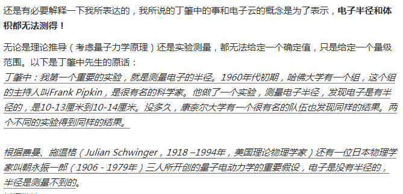

---

title: 普朗克常数是一个球的体积

date: 2020-12-29 22:31:35

categories: one

tags: 
  - one

original_url: http://blog.sina.com.cn/s/blog_691b45d30102y1r4.html

---

# 普朗克常数是一个球的体积

  

**新年贺礼**

**——：一个意外的发现，不知道对不对哈**

**by lione3000**

**普朗克常数h，竟然是一个球体积：h=V**

也即最小普朗克长度：r=\[（3/4）h/π\]^（1/3）

现在有一种量子曲率理论，也即通过曲率来解析量子场。

普朗克常数h等于一个球体积V，也就意味着存在一个最小球体，作为物质存在的最小实体。

在我们所在的宇宙时空之中，最小的费米粒子物质就是是电子，这个最小半径可能就是电子的半径。

**我算出普朗克球半径：**

**r（h）=5.4082396×10^-12** 

虽然比丁肇中的实验估计，明显大了1~2个数量级，但这是个确定的数。因为电子不是一个，像宏观物质那样的实体粒子，而是一个像雾像雨又像风，具有波粒二象性性质的物质能量体，一旦有外来电磁场作用，电子能量体就会产生洛伦茨收缩，所以电子的实际存在自然尺寸，应该比实验所测的数值更大。也就是说，当有外来电磁场作用时，电子球就会变形为椭球，甚至被拉成一条线形状，这时所测的电子半径，就会变得非常小，但此时电子的体积不会改变，仍然等于普朗克球半径的大小。

由此可以计算出电子之面电荷密度（surface charge density）

定　义：在准无穷小面积元A的给定点上，等于面积元上总电荷Q除以面积A。标量，符号“σ”。

电子电荷 ：电荷的一个重要特性是它的“量子性”，即任何带电体的电荷只能是某一基本单位的整数倍。这个基本单位就是一个电子所带的电荷，叫做电子电荷。

e的精确值(1986年推荐值)为： e=1.60217733×10-19

**一、“普朗克球”电子面电荷密度：**

σ=e/A=e/4π（r）^2

\=（1.60217733×10^-19）/4×（3.14159265）×（5.4082396×10^-12）^2

\=436（库仑/厘米，1库仑=1安培·1秒）

也即：**σ=436**（库仑/厘米，1库仑=1安培·1秒）

**导电材料电荷密度极限：**

铜导线每平方厘米的电流密度

公式：J=I/S=60A/厘米^2

1库仑约相当于6.25×1018个电子的电量。

**导线或超导体最大电流密度在200库仑/厘米左右，也即电子面电荷密度436库仑/厘米是一个能量传输的极限。**

**二、地-月系统与氢原子-电子系统尺度比较：**

地球到月球的平均距离是 384,403.9千米

月球的平均直径 3,474.1 千米 

384,403.9/3,474.1=110.6484844996

氢原子基态的电子轨道半径r=0.528×10-8 cm

普朗克球电子半径：r（h）=5.4082396×10^-12 cm

普朗克球电子直径：2r（h）=10.8164784×10^-12 cm

0.528×10-8/10.8164784×10^-12=488.144089

**地月距离直径比与氢原子电子距离直径比：110与488，两者相差不到5倍，也即两者基本上处于同一数量级。**

**488.144089/110.6484844996=4.4116653853，也即月亮比电子大4.4倍**

**110.6484844996/488.144089=0.2266717697，也即电子是月亮的0.23倍**

**也就是说，站在氢原子核上看电子，只有站在地球看月亮的五分之一大小。**

lione3000 2017-12-31