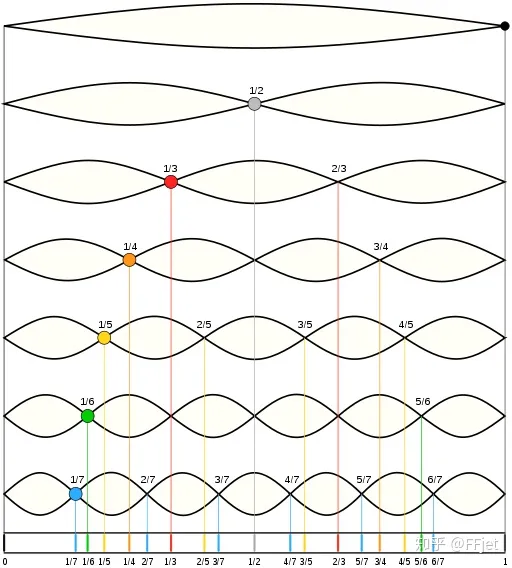

# 音乐与数学(1) - 从正弦函数讲起

## 物理常识

物体在一定的振动频率下产生声音。可能读者已经了解到，声音可以被分解为不同频率不同强度正弦波的叠加。那么为什么是正弦波？

考虑在两端固定的轻质振动弦。放置一个质量为m的沉重的珠子在中间，绳子在珠子上施加力F使其回到平衡点。

与平衡位置的垂直距离 x 成正比: $F=kx$

根据牛顿第二定律：

$F=ma=m \dfrac{\text{d}^2x}{\text{d}t^2}$

我们可以得到方程： $\dfrac{\text{d}^2x}{\text{d}t^2}+\dfrac{k}{m}x=0$

用 $\omega$ 代换 $\dfrac{k}{m} $ ，很容易得到这个方程的解为 $x=A\cos\omega t+B\sin \omega t$  
根据一些高中数学的常识，这个可以写成 $x=C\sin(\omega+\varphi)$ 的形式，其中 $C=\sqrt{A^2+B^2}$ ， $\varphi$ 满足 $\sin \varphi =\dfrac{B}{\sqrt{A^2+B^2}}$ ， $\cos \varphi =\dfrac{A}{\sqrt{A^2+B^2}}$

于是你就知道为什么可以表示为正弦波了。在上述式子中，我们称 $C$ 为**幅度**， $\dfrac{\omega}{2\pi}$ 是**频率**， $\varphi$ 是**相位**

* * *

联系一下弹吉他时的场景：按住一半的弦的位置，中间部分可以保持静止，而两半部分以相反的相位振动。产生的声音恰好是频率的两倍，听起来就是一个更高的八度。我们从数学上得到的是

$x = A \cos 2ωt + B \sin 2ωt$

如果我们按住 $\frac{1}{3}$ 的位置我们得到的又是

$x= \tilde{A} \cos 3ωt + \tilde{B} \sin 3ωt$

然而这里得到的是一个纯的八度音和一个纯五度音

为什么不是更高的一个八度音呢，这要涉及到**拍音叠加**和**谐波叠加**，稍后会讲到

弹拨弦其实就是以各种固定频率的倍数和不同的振幅所描述的模式的混合振动过程。不难推广上面那个式子，得到

$x = \sum_{n=0}^\infty(A_n \cos(nωt) + B_n \sin(nωt))$

傅立叶级数的钟声响了.jpg

这个式子其实是非常重要的（在频谱分析中），然而作为第一篇文章我并不打算深入讲这个的应用。我们进入下一节，也就是**基波**和**谐波**这两个基本概念

* * *

## 基波、谐波？谐波叠加、拍音叠加？

**基波**：将一个标准的正弦波作为基准，称作**基波**。

**谐波**：比基波的频率高整数倍的波被称作**谐波。**钢琴按下一个键或小提琴拉响一根弦都会在基波的基础上产生**多个谐波。**例如某个纯音声波的频率是 f ，将此纯音作为基波，其谐波的频率可为 2f,3f,4f ……，这些谐波分别称为二次谐波、三次谐波、四次谐波等。 m 次谐波的频率理所应当的是 mf 。

考虑这样一个问题：为什么八度音程的音符听起来很和谐，而音符稍微少一点就会发出令人难受的声音?

上文已经提过，一个八度的间隔意味着**振动频率加倍**：在钢琴上有个非常标准的例子：紧贴着中央C下面的A音频率是 220Hz ，而在紧贴着中央C上的A的音频率是 440Hz

给一张图具体地理解一下谐波：

最上面的是基波，从第二行往下分别是一次谐波、二次谐波等等

若一个复合音由基波与及其谐波相叠加构成，则称该复合音为**谐波叠加**，它的频率为**基波频率**

基波与谐波叠加构成复合音的过程

所有传统乐器所发出的音都是复合音，由振幅最大的基波和一些列振幅较小的谐波叠加构成。

**单音**：**单音**特指单一乐器演奏独立的一个音发出的声波（谐波叠加），其基波的频率称为**音高**。

不同乐器的单音所叠加的谐波在频率和振幅上都不相同，因此乐器的音色各不相同。我们可以来看一下小提琴的单音的波形：

小提琴的单音，典型的一种谐波叠加

总的来说，组成一个谐波叠加的音的所有正弦波的频率都是基波的倍数。

  

**拍音**：人耳所感觉到的由两个振动频率相近的声波所合成的强弱相间的声音

拍音叠加的定义也就呼之欲出了---显然大部分情况之下我们无法做到组成复合音的纯音频率互为倍数，这时候就叫做**拍音叠加**

* * *

## 复合音的频率？谐和？

本文的重点就在这啦！还记得上文的那两个A音的组合吗？其实把两个音写成频率列就是这样：

440, 880, 1320, 1760, ...

220, 440, 660, 880, ...

第一个音当然是基波，后面的都是泛音（谐波）。我们可以看粗来他们都是220的倍数，所以它们是谐波叠加。

但是如果有两个音，频率分别是 220Hz 和 445Hz ，那会发生什么？还是把频率数列写出来：

445, 890, 1335, 1780, ...

220, 440, 660, 880, ...

根据一些经验，我们会得到听起来不太舒服的声音。这是因为像 440/445Hz 、 880/890Hz 这种东西的存在使得这个复合音是不和谐的。

问题来了：如何任意给你两个频率，如何才能知道这个复合音听上去怎么样？

事实上上文已经给出了答案。我们观察正弦函数，两个不同周期的正弦函数的合成的周期显然是这两个正弦函数的周期的lcm。

相应地，频率是周期的倒数，那么复合音的频率就是 $\gcd\left ( \dfrac{1}{a},\dfrac{1}{b} \right )$ 。

对于一个**正常人**而言，通过大量的统计研究表明，人耳一般会认为复合音的频率越高，声音越悦耳，**即两个音的频率的倒数的最小公倍数应尽量小，这两个音就显得_彼此谐和_**

hey，这里还有一个问题。如果 $a,b \in \mathbb{R} \\ \mathbb{Q}$ 该怎么办？这时候gcd岂不是没法求了？

注意了，物理世界里面的精度是有限的，当然不存在要给两个无理数求gcd这么奇怪的事情。例如两个音的周期为 $\sqrt{3}$ 和 $\sqrt{5}$ ，理论上这不是一个周期函数，这时需要用到近似。这个复合音的频率可以认为是 $\dfrac{1}{4\sqrt{3}}$ ，因为 $\dfrac{ \sqrt{3} }{ \sqrt{5} } \approx 0.7746 \approx 0.75$ ，也就是 3:4 。因此这个拍音的“听感频率”大约在 $\dfrac{\sqrt{5}}{4} 和 \dfrac{\sqrt{3}}{3}$ 之间。

  

这篇文章就先介绍到这里，下一篇文章会讲群论在音乐里面的一些运用。